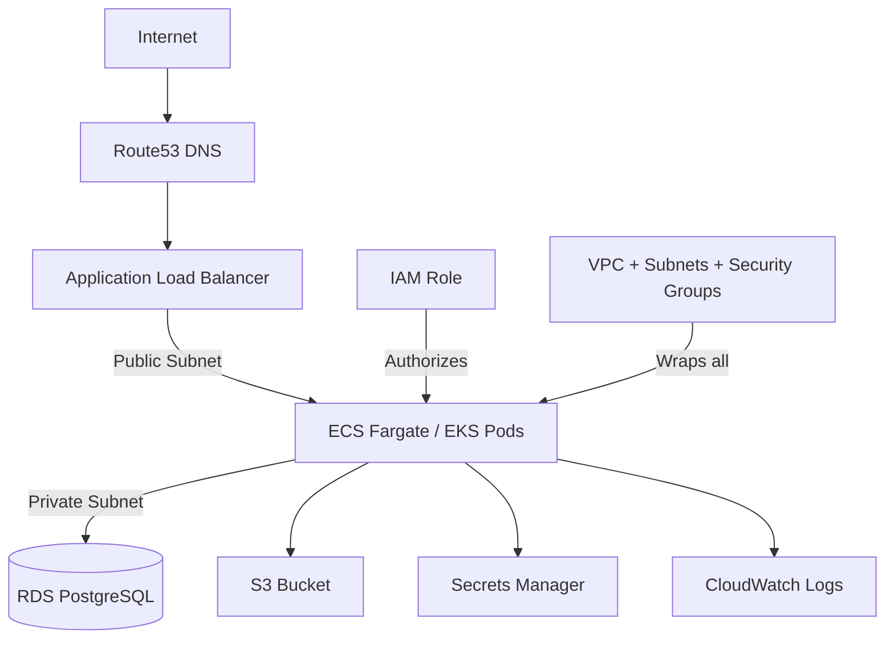

# AWS: From Zero to Production

> **The Anvaya:** *AWS is a menu of managed primitives — compute, network, storage, and identity — that you compose into a system; the skill is knowing which primitive solves which problem and how they authorize each other.*

## 🪝 The Hook

You want to deploy a containerized app that is highly available, has a managed database, ships logs to a searchable sink, and can be deployed from a GitHub push. AWS gives you 200+ services to do this — the challenge is knowing which 10 actually matter.

---

## **Architecture Overview**



Every resource lives inside a **Region**. Every Region has multiple **Availability Zones** (AZs — independent data centers). Spread across AZs = high availability.

---

## **Phase 1: Account Foundations**

**Goal:** A secure AWS account you can work in without using root credentials.

**Step 1: Secure the root user immediately**

- Enable **MFA** on the root user (Settings → Security credentials → MFA). The root user is the god account — it bypasses all IAM policies.
- Create a **billing alert**: CloudWatch → Alarms → Billing → $10 threshold. AWS won't warn you about surprise costs otherwise.
- Never generate root access keys. If they exist, delete them now.

**Step 2: Create an IAM admin user for daily use**

```bash
# In AWS Console: IAM → Users → Create user
# Attach policy: AdministratorAccess
# Enable MFA on this user too
# Generate Access Keys → download → configure CLI
aws configure --profile personal
# AWS Access Key ID: AKIA...
# AWS Secret Access Key: ...
# Default region: ap-south-1   (or your nearest region)
# Default output format: json
```

**Step 3: Pick and stick to a region**
Choose one region for all your work (e.g., `ap-south-1` for Mumbai, `us-east-1` for N. Virginia). Cross-region data transfer adds latency and cost.

**What You Learned:**

- ✅ Root user = emergency-only. Create an IAM admin user for all daily operations.
- ✅ Billing alerts are not automatic. Set one before doing anything else.
- ✅ `aws configure --profile <name>` creates named profiles so you can manage multiple accounts.

⚠️ **ANTI-PATTERN: Using root credentials for CLI access**
Root access keys can never be restricted by IAM policies. If leaked, the entire account is compromised. There is no recovery. Always use IAM user or role credentials.

---

## **Phase 2: IAM — Identity & Authorization**

**Goal:** Understand who can do what in AWS. Everything else depends on this.

**The mental model:**

```
Principal (who?)  →  Action (what?)  →  Resource (on what?)  →  Condition (when?)
```

**IAM Policy — the unit of permission:**

```json
{
  "Version": "2012-10-17",
  "Statement": [
    {
      "Effect": "Allow",
      "Action": [
        "s3:GetObject",
        "s3:PutObject"
      ],
      "Resource": "arn:aws:s3:::my-app-bucket/*",
      "Condition": {
        "StringEquals": { "aws:RequestedRegion": "ap-south-1" }
      }
    }
  ]
}
```

**IAM Role — the right way to give AWS services permissions:**
A **Role** [[?](Concepts.md#iam-role)] is an identity with a **Trust Policy** (who can assume it) and **Permission Policies** (what it can do). EC2, Lambda, ECS tasks, and EKS pods all authenticate to AWS via roles — never via embedded credentials.

```json
// Trust Policy: allows EC2 to assume this role
{
  "Statement": [{
    "Effect": "Allow",
    "Principal": { "Service": "ec2.amazonaws.com" },
    "Action": "sts:AssumeRole"
  }]
}
```

**Least Privilege in practice:**

```
Start with managed policies for speed → Lock down with custom policies for production
Never: AdministratorAccess on application roles
Never: "Resource": "*" in production service policies
```

**OIDC for GitHub Actions (no long-lived keys):**
See [GitHub Actions Phase 4](../github-actions/GitHub-Actions-From-Zero-To-Production.md). This is the modern way to deploy from CI.

**What You Learned:**

- ✅ **Users** = human identity with long-term credentials. **Roles** = machine identity with short-term credentials. Prefer roles for everything automated.
- ✅ Every AWS API call is an authorization check: does this principal have `Action` on `Resource`? Policies say yes or no.
- ✅ **ARN** (Amazon Resource Name — globally unique resource identifier [[?](Concepts.md#arn)]) is the universal identifier: `arn:aws:s3:::bucket-name`, `arn:aws:iam::123456:role/my-role`.
- ✅ **Principle of least privilege:** grant only the minimum permissions needed. Audit with IAM Access Analyzer.

💡 **TIP: Use IAM Policy Simulator**
Before deploying, test whether a role actually has the permissions you think it does: IAM Console → Policy Simulator → select role → test action.

⚠️ **ANTI-PATTERN: Hardcoding credentials in code or environment variables**

```bash
# ❌ Never do this
export AWS_ACCESS_KEY_ID=AKIAxxx
export AWS_SECRET_ACCESS_KEY=xxx
# Leaked in logs, git history, process list. Rotated manually. No audit trail.

# ✅ Use an IAM Role. The AWS SDK finds credentials automatically via the credential chain:
# 1. Environment variables → 2. ~/.aws/credentials → 3. Instance/task role metadata
```

---

## **Phase 3: VPC — Your Private Network**

**Goal:** A VPC with public and private subnets — the foundation every other service sits inside.

**The minimal production VPC layout:**

```
VPC: 10.0.0.0/16  (65,536 IPs)
├── Public Subnet A:  10.0.1.0/24  (AZ ap-south-1a) → Internet Gateway → ALB, Bastion
├── Public Subnet B:  10.0.2.0/24  (AZ ap-south-1b) → Internet Gateway → ALB
├── Private Subnet A: 10.0.3.0/24  (AZ ap-south-1a) → NAT Gateway → EC2, ECS, EKS nodes
├── Private Subnet B: 10.0.4.0/24  (AZ ap-south-1b) → NAT Gateway → EC2, ECS, EKS nodes
├── DB Subnet A:      10.0.5.0/24  (AZ ap-south-1a) → No internet → RDS only
└── DB Subnet B:      10.0.6.0/24  (AZ ap-south-1b) → No internet → RDS only
```

**Traffic flow:**

- **Public subnet:** has a route to **Internet Gateway** [[?](Concepts.md#internet-gateway)]. Resources can have public IPs. Use for: ALB, NAT Gateway, Bastion host.
- **Private subnet:** routes internet traffic to **NAT Gateway** [[?](Concepts.md#nat-gateway)] in the public subnet. Resources have only private IPs. Use for: your app servers.
- **DB subnet:** no internet route at all. Accessible only from within the VPC. Use for: RDS, ElastiCache.

**Security Groups — the instance-level firewall:**

```
Security Group: allow-web-traffic
  Inbound:  TCP 80, 443  from 0.0.0.0/0   (public HTTP/HTTPS)
  Outbound: All traffic  to   0.0.0.0/0   (default, allow all outbound)

Security Group: allow-app-from-alb
  Inbound:  TCP 8080  from sg-<alb-security-group>   (reference SG, not IP range!)
  Outbound: All traffic to 0.0.0.0/0

Security Group: allow-db-from-app
  Inbound:  TCP 5432  from sg-<app-security-group>   (only app tier can reach DB)
  Outbound: (none needed)
```

**What You Learned:**

- ✅ **Security Groups** [[?](Concepts.md#security-group)] are stateful, instance-level firewalls. Referencing another SG (not a CIDR) is the production pattern — your DB tier automatically allows new app servers as they scale.
- ✅ Always deploy across **2+ AZs**. A single-AZ deployment is a single point of failure.
- ✅ Your app servers go in **private subnets**. They never need a public IP — the ALB in the public subnet receives traffic and forwards it.
- ✅ **NAT Gateway** lets private subnet resources reach the internet (for package updates, external APIs) without being reachable from the internet.

💡 **TIP: Use Terraform for VPC**
Never click-create a VPC. Use the `terraform-aws-modules/vpc` module — it creates the subnets, route tables, IGW, and NAT Gateway in ~20 lines of HCL with sensible defaults.

⚠️ **ANTI-PATTERN: Putting app servers in public subnets**
Many tutorials put EC2 in public subnets for simplicity. In production, any instance that doesn't need to receive inbound internet traffic belongs in a private subnet. Reduces attack surface significantly.

---

## **Phase 4: EC2 — Virtual Machines**

**Goal:** Launch an EC2 instance that securely runs a workload with no long-lived credentials.

**The right way to launch an EC2 instance:**

```bash
# 1. Create an IAM Instance Role with the permissions your app needs
aws iam create-role --role-name app-server-role \
  --assume-role-policy-document file://ec2-trust-policy.json

# 2. Attach needed permissions (example: read from S3)
aws iam attach-role-policy --role-name app-server-role \
  --policy-arn arn:aws:iam::aws:policy/AmazonS3ReadOnlyAccess

# 3. Create an instance profile (wrapper that lets EC2 use the role)
aws iam create-instance-profile --instance-profile-name app-server-profile
aws iam add-role-to-instance-profile --instance-profile-name app-server-profile \
  --role-name app-server-role

# 4. Launch instance in PRIVATE subnet, attach the instance profile
aws ec2 run-instances \
  --image-id ami-0f58b397bc5c1f2e8 \   # Amazon Linux 2023 in ap-south-1
  --instance-type t3.small \
  --subnet-id subnet-xxx \             # Private subnet
  --security-group-ids sg-xxx \
  --iam-instance-profile Name=app-server-profile \
  --user-data file://startup-script.sh \
  --no-associate-public-ip-address     # Private subnet: no public IP needed
```

**User Data — run a script on first boot:**

```bash
#!/bin/bash
# startup-script.sh — runs as root on first launch
set -e
dnf update -y
dnf install -y docker
systemctl enable --now docker

# Pull and run your app (no credentials needed — instance role provides them)
aws ecr get-login-password --region ap-south-1 | \
  docker login --username AWS --password-stdin 123456789.dkr.ecr.ap-south-1.amazonaws.com

docker run -d -p 8080:8080 \
  --restart unless-stopped \
  123456789.dkr.ecr.ap-south-1.amazonaws.com/myapp:latest
```

**Instance Types — quick guide:**

| Family | Use case | Example |
| :--- | :--- | :--- |
| `t3` | Burstable, low-cost dev/staging | `t3.small` (2 vCPU, 2 GB) |
| `m6i` | General-purpose production | `m6i.large` (2 vCPU, 8 GB) |
| `c6i` | CPU-intensive (builds, encoding) | `c6i.xlarge` |
| `r6i` | Memory-intensive (caches, DBs) | `r6i.large` |
| `g4dn` | GPU (ML inference) | `g4dn.xlarge` |

**What You Learned:**

- ✅ Never SSH with a password. Use **key pairs** (you keep the private key, AWS installs the public key) or **AWS Systems Manager Session Manager** (no open SSH port at all — recommended).
- ✅ Your app should never have AWS credentials stored on it. The **IAM Instance Role** metadata endpoint (`169.254.169.254`) provides automatically-rotated credentials to the AWS SDK.
- ✅ **User Data** runs once on first boot as root. Use it to install and start your application.
- ✅ For production, use **Launch Templates** + **Auto Scaling Groups** so EC2 scales and self-heals.

💡 **TIP: SSM Session Manager instead of SSH**

```bash
aws ssm start-session --target i-0abc123def456
```

No open port 22. No key management. Fully audited in CloudTrail. Works on instances with no public IP.

---

## **Phase 5: S3 — Object Storage**

**Goal:** Store blobs, artifacts, Terraform state, and static sites durably and cheaply.

**S3 is the universal glue** — Terraform keeps state here, CI uploads artifacts here, ECS pulls configs from here, CloudWatch exports logs here.

```bash
# Create a bucket (bucket names are globally unique across all AWS accounts)
aws s3api create-bucket \
  --bucket myapp-artifacts-prod \
  --region ap-south-1 \
  --create-bucket-configuration LocationConstraint=ap-south-1

# Enable versioning (required for Terraform state backend)
aws s3api put-bucket-versioning \
  --bucket myapp-artifacts-prod \
  --versioning-configuration Status=Enabled

# Block all public access (default for new buckets — keep it)
aws s3api put-public-access-block \
  --bucket myapp-artifacts-prod \
  --public-access-block-configuration "BlockPublicAcls=true,IgnorePublicAcls=true,BlockPublicPolicy=true,RestrictPublicBuckets=true"
```

**Bucket Policy — control cross-account and service access:**

```json
{
  "Statement": [
    {
      "Effect": "Allow",
      "Principal": { "AWS": "arn:aws:iam::123456789:role/app-server-role" },
      "Action": ["s3:GetObject", "s3:PutObject"],
      "Resource": "arn:aws:s3:::myapp-artifacts-prod/*"
    }
  ]
}
```

**Lifecycle rule — automatic cost management:**

```json
{
  "Rules": [{
    "Status": "Enabled",
    "Filter": { "Prefix": "logs/" },
    "Transitions": [
      { "Days": 30, "StorageClass": "STANDARD_IA" },   // Move to Infrequent Access after 30 days
      { "Days": 90, "StorageClass": "GLACIER" }        // Move to Glacier after 90 days
    ],
    "Expiration": { "Days": 365 }                      // Delete after 1 year
  }]
}
```

**What You Learned:**

- ✅ S3 is infinitely durable (11 nines). Use it as your default blob store.
- ✅ Always block public access unless you're intentionally hosting a public static site.
- ✅ **Lifecycle rules** are mandatory for cost control — unmanaged S3 buckets silently accumulate gigabytes.
- ✅ **Versioning** protects against accidental deletion and is required for Terraform S3 backends.

---

## **Phase 6: ECR — Container Registry**

**Goal:** Store and serve Docker images to ECS/EKS without DockerHub rate limits.

```bash
# Create a repository
aws ecr create-repository \
  --repository-name myapp \
  --image-scanning-configuration scanOnPush=true \
  --region ap-south-1

# Authenticate Docker to ECR
aws ecr get-login-password --region ap-south-1 | \
  docker login --username AWS --password-stdin \
  123456789.dkr.ecr.ap-south-1.amazonaws.com

# Build, tag, push
docker build -t myapp:latest .
docker tag myapp:latest 123456789.dkr.ecr.ap-south-1.amazonaws.com/myapp:latest
docker push 123456789.dkr.ecr.ap-south-1.amazonaws.com/myapp:latest
```

**Lifecycle Policy — auto-delete old images (critical for cost):**

```json
{
  "rules": [{
    "rulePriority": 1,
    "description": "Keep only last 10 images",
    "selection": {
      "tagStatus": "any",
      "countType": "imageCountMoreThan",
      "countNumber": 10
    },
    "action": { "type": "expire" }
  }]
}
```

✨ **BEST PRACTICE: Enable `scanOnPush`**
ECR scans images against the CVE database on every push. Free for `BASIC` scanning. Review the findings in ECR Console → Repositories → Findings before deploying to prod.

---

## **Phase 7: ECS Fargate — Serverless Containers**

**Goal:** Run containers without managing EC2 instances. Simpler than EKS for most teams.

**When to choose ECS over EKS:** ECS is managed by AWS, less operational overhead, fully integrates with ALB and IAM. Choose EKS when you need Kubernetes-native tooling (Helm, custom operators, multi-cloud portability).

**The ECS hierarchy:** `Cluster → Service → Task Definition → Container`

**Task Definition — the container spec:**

```json
{
  "family": "myapp",
  "networkMode": "awsvpc",
  "requiresCompatibilities": ["FARGATE"],
  "cpu": "512",
  "memory": "1024",
  "executionRoleArn": "arn:aws:iam::123456:role/ecsTaskExecutionRole",
  "taskRoleArn": "arn:aws:iam::123456:role/myapp-task-role",
  "containerDefinitions": [{
    "name": "myapp",
    "image": "123456.dkr.ecr.ap-south-1.amazonaws.com/myapp:latest",
    "portMappings": [{ "containerPort": 8080, "protocol": "tcp" }],
    "environment": [
      { "name": "ENV", "value": "production" }
    ],
    "secrets": [
      {
        "name": "DB_PASSWORD",
        "valueFrom": "arn:aws:secretsmanager:ap-south-1:123456:secret:myapp/db-password"
      }
    ],
    "logConfiguration": {
      "logDriver": "awslogs",
      "options": {
        "awslogs-group": "/ecs/myapp",
        "awslogs-region": "ap-south-1",
        "awslogs-stream-prefix": "ecs"
      }
    }
  }]
}
```

**Two IAM roles ECS needs:**

| Role | Purpose |
| :--- | :--- |
| `executionRoleArn` | ECS *agent* pulls image from ECR, writes logs to CloudWatch, fetches secrets |
| `taskRoleArn` | Your *application code* calls AWS APIs (S3, SQS, etc.) |

**Create ECS Service (with ALB):**

```bash
aws ecs create-service \
  --cluster myapp-cluster \
  --service-name myapp \
  --task-definition myapp:1 \
  --desired-count 2 \
  --launch-type FARGATE \
  --network-configuration "awsvpcConfiguration={subnets=[subnet-priv-a,subnet-priv-b],securityGroups=[sg-app],assignPublicIp=DISABLED}" \
  --load-balancers "targetGroupArn=arn:aws:elasticloadbalancing:...,containerName=myapp,containerPort=8080"
```

**What You Learned:**

- ✅ Fargate = no EC2 to manage. AWS handles the host OS, patching, and scheduling.
- ✅ There are **two** task IAM roles: one for the ECS agent (pulling image, writing logs), one for your application.
- ✅ Secrets from Secrets Manager are injected as environment variables — your code reads `process.env.DB_PASSWORD`, never calls Secrets Manager directly.
- ✅ `desired-count: 2` across 2 AZs = high availability. One task failure leaves the service running.

---

## **Phase 8: EKS — Managed Kubernetes**

**Goal:** Run Kubernetes on AWS without operating the control plane.

EKS manages the Kubernetes API server. You manage the **node groups** (EC2 instances that run pods) or use **Fargate profiles** for serverless pods.

**Create an EKS cluster (using eksctl — easiest approach):**

```bash
# Install eksctl: https://eksctl.io
eksctl create cluster \
  --name myapp-prod \
  --region ap-south-1 \
  --version 1.31 \
  --nodegroup-name standard-workers \
  --node-type m6i.large \
  --nodes-min 2 \
  --nodes-max 5 \
  --managed \                      # AWS manages node OS patching
  --with-oidc \                    # Enable IRSA (IAM roles for service accounts)
  --ssh-access \
  --ssh-public-key my-key-pair

# Configure kubectl
aws eks update-kubeconfig --name myapp-prod --region ap-south-1
kubectl get nodes
```

**IRSA — IAM Roles for Service Accounts (the key EKS-IAM pattern):**
IRSA [[?](Concepts.md#irsa)] lets Kubernetes pods assume IAM Roles without node-level credentials.

```bash
# Create an IAM role that a specific service account can assume
eksctl create iamserviceaccount \
  --name myapp-sa \
  --namespace production \
  --cluster myapp-prod \
  --attach-policy-arn arn:aws:iam::aws:policy/AmazonS3ReadOnlyAccess \
  --approve

# In your Pod spec:
# spec:
#   serviceAccountName: myapp-sa
# The pod now has S3 read access — no credentials stored anywhere.
```

**What You Learned:**

- ✅ **IRSA** is the EKS equivalent of EC2 Instance Roles. Annotate a Kubernetes ServiceAccount with the IAM Role ARN, and pods using that SA get AWS credentials automatically.
- ✅ Enable the **AWS Load Balancer Controller** addon to provision ALBs from Kubernetes `Ingress` objects.
- ✅ Enable **Container Insights** for CloudWatch metrics on pod CPU/memory.
- ✅ EKS control plane logging (API server, audit) is off by default. Enable it for compliance.

💡 **TIP: Use managed node groups**
Managed node groups handle OS updates and node replacement for you. Unmanaged node groups require you to roll nodes manually.

---

## **Phase 9: RDS — Managed Relational Database**

**Goal:** A production-grade PostgreSQL instance that never touches the internet.

```bash
# Create a DB subnet group (RDS needs subnets in 2+ AZs from the DB tier)
aws rds create-db-subnet-group \
  --db-subnet-group-name myapp-db-subnet-group \
  --db-subnet-group-description "DB subnets for myapp" \
  --subnet-ids subnet-db-a subnet-db-b

# Create a PostgreSQL instance
aws rds create-db-instance \
  --db-instance-identifier myapp-postgres \
  --db-instance-class db.t3.medium \
  --engine postgres \
  --engine-version 16 \
  --master-username admin \
  --manage-master-user-password \    # Stores password in Secrets Manager automatically!
  --allocated-storage 20 \
  --db-subnet-group-name myapp-db-subnet-group \
  --vpc-security-group-ids sg-db \
  --backup-retention-period 7 \      # 7-day automated backups
  --multi-az \                       # Synchronous standby in second AZ
  --no-publicly-accessible
```

**What You Learned:**

- ✅ `--no-publicly-accessible` + DB-only subnet = database never reachable from the internet.
- ✅ `--multi-az` creates a synchronous standby replica in a second AZ. Automatic failover in ~60s if the primary fails.
- ✅ `--manage-master-user-password` lets AWS create and store the master password in Secrets Manager — you never see or store the password.
- ✅ Security Group for RDS should allow inbound port 5432 **only from the app tier Security Group**.

⚠️ **ANTI-PATTERN: `--publicly-accessible` for "quick access"**
This is the single most common AWS misconfiguration leading to data breaches. RDS should never be publicly accessible. Use SSM Session Manager port forwarding to connect from your local machine for debugging.

---

## **Phase 10: Secrets Manager & SSM Parameter Store**

**Goal:** Store and retrieve secrets without hardcoding them anywhere.

**When to use which:**

| | Secrets Manager | SSM Parameter Store |
| :--- | :--- | :--- |
| **Cost** | ~$0.40/secret/month | Free (Standard tier) |
| **Rotation** | Built-in Lambda rotation for RDS, Redshift | Manual |
| **Use for** | DB passwords, API keys, certs | Config values, feature flags, non-secret params |

**Store a secret:**

```bash
aws secretsmanager create-secret \
  --name myapp/prod/db-password \
  --secret-string '{"password":"sup3r-s3cr3t"}' \
  --region ap-south-1

# Retrieve in code (Go SDK):
# result, _ := svc.GetSecretValue(&secretsmanager.GetSecretValueInput{SecretId: aws.String("myapp/prod/db-password")})
```

**Enable automatic rotation (for RDS passwords):**

```bash
aws secretsmanager rotate-secret \
  --secret-id myapp/prod/db-password \
  --rotation-rules AutomaticallyAfterDays=30
# AWS runs a Lambda function to rotate the password in both Secrets Manager and RDS.
```

**What You Learned:**

- ✅ ECS tasks and EC2 instances can read secrets at runtime via the instance/task role — no secrets in Dockerfiles or environment variable injection at build time.
- ✅ Use a **naming convention**: `<app>/<env>/<secret-name>`. Makes IAM policies clean: `arn:aws:secretsmanager:*:*:secret:myapp/prod/*`.
- ✅ SSM Parameter Store **SecureString** type encrypts values with KMS — good free alternative for low-volume secrets.

---

## **Phase 11: ALB & Route53 — Load Balancing & DNS**

**Goal:** Route internet traffic to your containers across AZs.

**Application Load Balancer [[?](Concepts.md#alb)] handles:**

- HTTP/HTTPS termination
- Path-based and host-based routing
- Health checks with automatic instance/task removal
- SSL termination (via ACM certificates — free)

```bash
# Create ALB in public subnets
aws elbv2 create-load-balancer \
  --name myapp-alb \
  --subnets subnet-pub-a subnet-pub-b \
  --security-groups sg-web \
  --scheme internet-facing \
  --type application

# Create Target Group (points at your ECS service)
aws elbv2 create-target-group \
  --name myapp-tg \
  --protocol HTTP \
  --port 8080 \
  --vpc-id vpc-xxx \
  --target-type ip \              # 'ip' for Fargate; 'instance' for EC2
  --health-check-path /healthz

# Add HTTPS listener (ACM certificate)
aws elbv2 create-listener \
  --load-balancer-arn arn:aws:... \
  --protocol HTTPS \
  --port 443 \
  --certificates CertificateArn=arn:aws:acm:... \
  --default-actions Type=forward,TargetGroupArn=arn:aws:...
```

**Route53 — point your domain at the ALB:**

```bash
# Create A record (alias) pointing domain to ALB
# In Route53: Hosted Zone → Create Record → Alias → ALB
# CLI equivalent (upsert):
aws route53 change-resource-record-sets --hosted-zone-id Z123 --change-batch '{
  "Changes": [{"Action": "UPSERT", "ResourceRecordSet": {
    "Name": "api.example.com",
    "Type": "A",
    "AliasTarget": {
      "HostedZoneId": "ZP97RAEMQ7N88",
      "DNSName": "myapp-alb-123.ap-south-1.elb.amazonaws.com",
      "EvaluateTargetHealth": true
    }
  }}]
}'
```

✨ **BEST PRACTICE: Always use ACM for TLS certificates**
AWS Certificate Manager (ACM) provides free TLS certificates that auto-renew. Never manage your own certs on ALB unless you have a specific reason.

---

## **Phase 12: CloudWatch — Observability**

**Goal:** See logs, metrics, and alerts without deploying Elasticsearch or Prometheus.

**Logs:**

```bash
# Create log group for your app
aws logs create-log-group --log-group-name /ecs/myapp --region ap-south-1

# Set retention (never let logs grow unbounded)
aws logs put-retention-policy \
  --log-group-name /ecs/myapp \
  --retention-in-days 30

# Tail logs from CLI
aws logs tail /ecs/myapp --follow --format short
```

**Metrics & Alarms:**

```bash
# Create a CPU alarm for an ECS service
aws cloudwatch put-metric-alarm \
  --alarm-name myapp-high-cpu \
  --metric-name CPUUtilization \
  --namespace AWS/ECS \
  --dimensions Name=ClusterName,Value=myapp-cluster Name=ServiceName,Value=myapp \
  --statistic Average \
  --period 60 \
  --threshold 80 \
  --comparison-operator GreaterThanThreshold \
  --evaluation-periods 3 \
  --alarm-actions arn:aws:sns:ap-south-1:123456:alerts-topic   # SNS → email/Slack
```

**Container Insights (enhanced metrics for ECS/EKS):**

```bash
# Enable for ECS cluster
aws ecs update-cluster --cluster myapp-cluster \
  --settings name=containerInsights,value=enabled

# Enable for EKS
aws eks update-cluster-config --name myapp-prod \
  --logging '{"clusterLogging":[{"types":["api","audit","authenticator"],"enabled":true}]}'
```

**What You Learned:**

- ✅ Always set **retention policies** on log groups. Default is "Never expire" — this will cost you.
- ✅ `aws logs tail --follow` is the `kubectl logs -f` equivalent for CloudWatch.
- ✅ **SNS Topic** is the alarm action destination. SNS fans out to email, Slack (via Lambda), PagerDuty, etc.
- ✅ Container Insights adds per-container CPU, memory, network, and disk metrics at extra cost (~$0.50/node/month).

---

## **Phase 13: CI/CD — Automated Deployment**

**Goal:** Every push to `main` tests, builds, and deploys to ECS automatically — without storing AWS credentials in GitHub.

```yaml
# .github/workflows/deploy.yml
name: Deploy to ECS

on:
  push:
    branches: [main]

permissions:
  id-token: write    # OIDC
  contents: read

jobs:
  deploy:
    runs-on: ubuntu-24.04
    steps:
      - uses: actions/checkout@11bd71901bbe5b1630ceea73d27597364c9af683  # v4

      - name: Configure AWS credentials via OIDC
        uses: aws-actions/configure-aws-credentials@e3dd6a429d7300a6a4c196c26e071d42e0343502  # v4
        with:
          role-to-assume: arn:aws:iam::123456789:role/github-actions-deploy
          aws-region: ap-south-1

      - name: Login to ECR
        id: ecr-login
        uses: aws-actions/amazon-ecr-login@062b18b96a7aff071d4dc91bc00c4c1a7945b076  # v2

      - name: Build and push Docker image
        env:
          ECR_REGISTRY: ${{ steps.ecr-login.outputs.registry }}
          IMAGE_TAG: ${{ github.sha }}
        run: |
          docker build -t $ECR_REGISTRY/myapp:$IMAGE_TAG .
          docker push $ECR_REGISTRY/myapp:$IMAGE_TAG
          echo "image=$ECR_REGISTRY/myapp:$IMAGE_TAG" >> $GITHUB_OUTPUT

      - name: Deploy to ECS
        run: |
          aws ecs update-service \
            --cluster myapp-cluster \
            --service myapp \
            --force-new-deployment
```

**IAM Role for GitHub Actions (OIDC trust policy):**

```json
{
  "Statement": [{
    "Effect": "Allow",
    "Principal": { "Federated": "arn:aws:iam::123456789:oidc-provider/token.actions.githubusercontent.com" },
    "Action": "sts:AssumeRoleWithWebIdentity",
    "Condition": {
      "StringEquals": {
        "token.actions.githubusercontent.com:aud": "sts.amazonaws.com"
      },
      "StringLike": {
        "token.actions.githubusercontent.com:sub": "repo:myorg/myapp:ref:refs/heads/main"
      }
    }
  }]
}
```

---

## 🔒 Security & Pitfalls

### 1. The S3 Public Bucket Breach

* **Pitfall:** Creating an S3 bucket and adding `"Principal": "*"` to the bucket policy for "easy access."
- **Fix:** Never use `"Principal": "*"`. Use account-level "Block Public Access" on all buckets. Access data via IAM roles, not public URLs.

### 2. The Overly Permissive Security Group

* **Pitfall:** `0.0.0.0/0` on port 22 (SSH) or 5432 (PostgreSQL) open to the internet — found by automated scanners within minutes of launch.
- **Fix:** Port 22 from `0.0.0.0/0` should never exist in production. Use SSM Session Manager. DB ports only from within the VPC.

### 3. The Root Account Access Key

* **Pitfall:** Generating root access keys "for quick CLI access." These keys with no IAM restrictions control billing, account settings, and all resources.
- **Fix:** Delete root access keys immediately. Use IAM roles for automation; IAM users with MFA for humans.

### 4. The Missing NAT Gateway Egress Cost

* **Pitfall:** Deploying ECS tasks in private subnets with a NAT Gateway but not realizing NAT Gateway charges $0.045/GB of data processed *plus* $0.045/hour per AZ.
- **Fix:** For internal-only services, use **VPC Endpoints** for S3 and DynamoDB (free). Use **PrivateLink** endpoints for other AWS services to bypass NAT entirely.

### 5. Logs Without Retention Policies

* **Pitfall:** CloudWatch log groups default to "Never expire." A busy ECS service generates gigabytes of logs monthly at $0.03/GB/month — silently.
- **Fix:** Always set `retention-in-days` when creating log groups. 30–90 days covers most debugging + compliance requirements.

### 6. The EKS Node IAM Role Credentials

* **Pitfall:** Attaching `PowerUserAccess` or broad permissions to the EKS node IAM role. Every pod inherits these permissions via the EC2 metadata endpoint.
- **Fix:** Use IRSA to grant per-pod permissions. Node role should have only `AmazonEKSWorkerNodePolicy`, `AmazonEKS_CNI_Policy`, and `AmazonEC2ContainerRegistryReadOnly`.

---

## 🚀 Summary Checklist

- ✅ **Phase 1:** Root in MFA, admin IAM user, billing alert, CLI profile configured.
- ✅ **Phase 2:** IAM Roles for all workloads; no long-lived credentials in code; least privilege policies.
- ✅ **Phase 3:** VPC with public/private/DB subnets across 2 AZs; Security Groups reference other SGs.
- ✅ **Phase 4:** EC2 in private subnets; IAM instance role; SSM Session Manager for access.
- ✅ **Phase 5:** S3 with public access blocked, versioning on, lifecycle rules set.
- ✅ **Phase 6:** ECR with `scanOnPush` enabled, lifecycle policy to cap image count.
- ✅ **Phase 7:** ECS Fargate with two task roles (execution + task); secrets injected from Secrets Manager.
- ✅ **Phase 8:** EKS with managed node groups, OIDC enabled for IRSA.
- ✅ **Phase 9:** RDS Multi-AZ, in DB subnets, no public accessibility, password in Secrets Manager.
- ✅ **Phase 10:** Secrets Manager for DB passwords with rotation; SSM for config values.
- ✅ **Phase 11:** ALB in public subnets, ACM cert, Route53 alias record.
- ✅ **Phase 12:** CloudWatch log groups with retention policies, CPU alarms, Container Insights.
- ✅ **Phase 13:** CI/CD via GitHub Actions + OIDC; no AWS credentials stored in GitHub.
