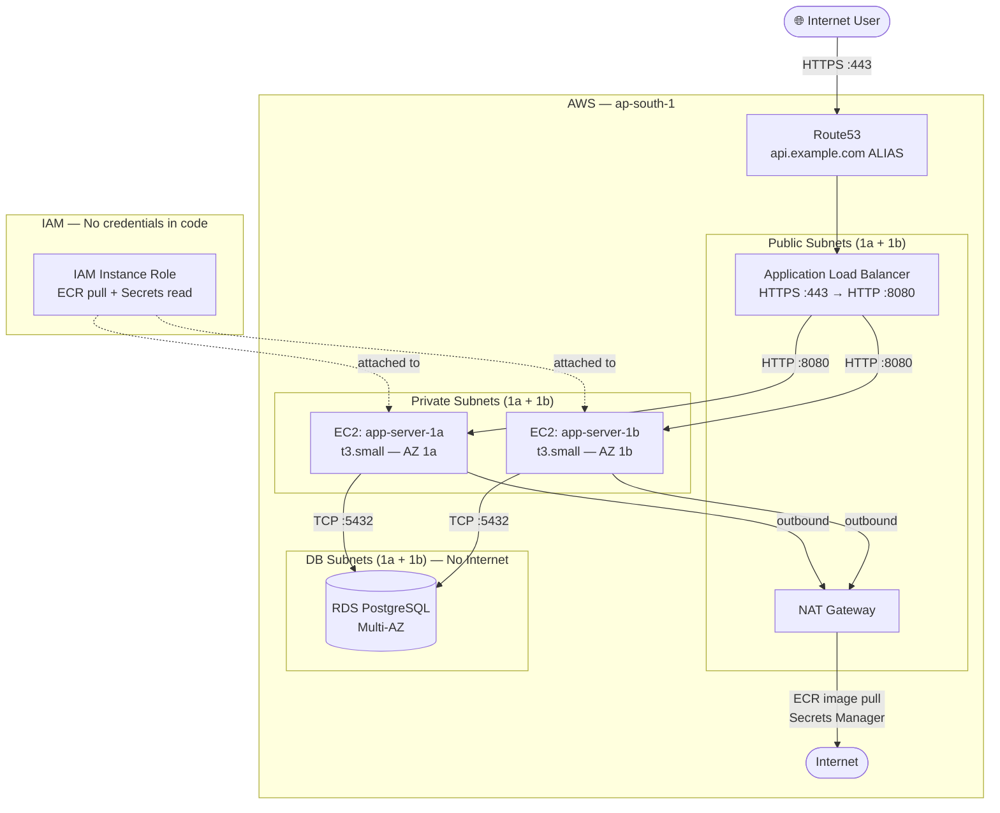
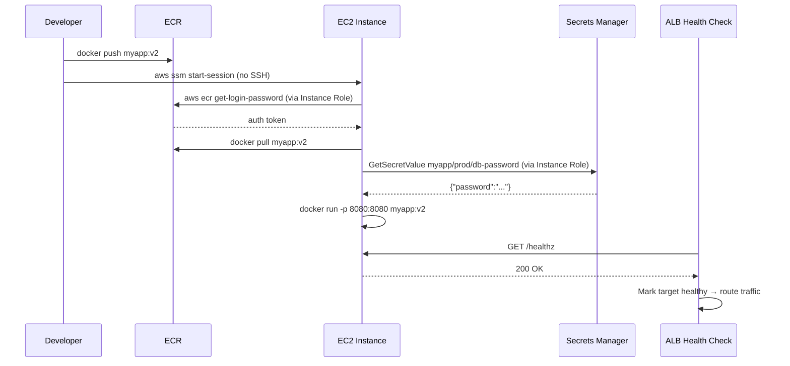

# AWS: EC2 Deployment Example

> **The Anvaya:** *An EC2 deployment is a stack of layers: network (VPC) → firewall (Security Groups) → compute (EC2) → traffic distribution (ALB) → DNS (Route53). Build bottom-up, tear down top-down.*

## 🪝 The Hook

Deploy a containerized Go API behind an Application Load Balancer, with the database in a private isolated subnet, accessible at `api.example.com` — with no hardcoded credentials and no open SSH port.

---

## **Target Architecture**



---

## **Step 1 — VPC & Subnets**

```bash
# Create the VPC
VPC_ID=$(aws ec2 create-vpc --cidr-block 10.0.0.0/16 \
  --tag-specifications 'ResourceType=vpc,Tags=[{Key=Name,Value=myapp-vpc}]' \
  --query 'Vpc.VpcId' --output text)

# Enable DNS hostnames (needed for RDS and SSM)
aws ec2 modify-vpc-attribute --vpc-id $VPC_ID --enable-dns-hostnames

# Create subnets (2 AZs for HA)
PUB_A=$(aws ec2 create-subnet --vpc-id $VPC_ID --cidr-block 10.0.1.0/24 \
  --availability-zone ap-south-1a \
  --tag-specifications 'ResourceType=subnet,Tags=[{Key=Name,Value=public-1a}]' \
  --query 'Subnet.SubnetId' --output text)

PUB_B=$(aws ec2 create-subnet --vpc-id $VPC_ID --cidr-block 10.0.2.0/24 \
  --availability-zone ap-south-1b \
  --tag-specifications 'ResourceType=subnet,Tags=[{Key=Name,Value=public-1b}]' \
  --query 'Subnet.SubnetId' --output text)

PRIV_A=$(aws ec2 create-subnet --vpc-id $VPC_ID --cidr-block 10.0.3.0/24 \
  --availability-zone ap-south-1a \
  --tag-specifications 'ResourceType=subnet,Tags=[{Key=Name,Value=private-1a}]' \
  --query 'Subnet.SubnetId' --output text)

PRIV_B=$(aws ec2 create-subnet --vpc-id $VPC_ID --cidr-block 10.0.4.0/24 \
  --availability-zone ap-south-1b \
  --tag-specifications 'ResourceType=subnet,Tags=[{Key=Name,Value=private-1b}]' \
  --query 'Subnet.SubnetId' --output text)

DB_A=$(aws ec2 create-subnet --vpc-id $VPC_ID --cidr-block 10.0.5.0/24 \
  --availability-zone ap-south-1a \
  --tag-specifications 'ResourceType=subnet,Tags=[{Key=Name,Value=db-1a}]' \
  --query 'Subnet.SubnetId' --output text)

DB_B=$(aws ec2 create-subnet --vpc-id $VPC_ID --cidr-block 10.0.6.0/24 \
  --availability-zone ap-south-1b \
  --tag-specifications 'ResourceType=subnet,Tags=[{Key=Name,Value=db-1b}]' \
  --query 'Subnet.SubnetId' --output text)
```

---

## **Step 2 — Internet Gateway & NAT Gateway**

```bash
# Internet Gateway → public subnets can reach the internet
IGW=$(aws ec2 create-internet-gateway --query 'InternetGateway.InternetGatewayId' --output text)
aws ec2 attach-internet-gateway --internet-gateway-id $IGW --vpc-id $VPC_ID

# Public route table: route all outbound to IGW
PUB_RT=$(aws ec2 create-route-table --vpc-id $VPC_ID --query 'RouteTable.RouteTableId' --output text)
aws ec2 create-route --route-table-id $PUB_RT --destination-cidr-block 0.0.0.0/0 --gateway-id $IGW
aws ec2 associate-route-table --route-table-id $PUB_RT --subnet-id $PUB_A
aws ec2 associate-route-table --route-table-id $PUB_RT --subnet-id $PUB_B

# NAT Gateway in ONE public subnet (costs ~$32/month + data — one per AZ for prod)
EIP=$(aws ec2 allocate-address --domain vpc --query 'AllocationId' --output text)
NAT=$(aws ec2 create-nat-gateway --subnet-id $PUB_A --allocation-id $EIP \
  --query 'NatGateway.NatGatewayId' --output text)
aws ec2 wait nat-gateway-available --nat-gateway-ids $NAT

# Private route table: route outbound to NAT Gateway
PRIV_RT=$(aws ec2 create-route-table --vpc-id $VPC_ID --query 'RouteTable.RouteTableId' --output text)
aws ec2 create-route --route-table-id $PRIV_RT --destination-cidr-block 0.0.0.0/0 --nat-gateway-id $NAT
aws ec2 associate-route-table --route-table-id $PRIV_RT --subnet-id $PRIV_A
aws ec2 associate-route-table --route-table-id $PRIV_RT --subnet-id $PRIV_B
# DB subnets get NO route — intentionally isolated
```

💡 **Single NAT Gateway = single point of failure.** If `ap-south-1a` has an AZ outage, the private instances in `1b` lose all outbound connectivity too — ECR pulls, Secrets Manager calls all fail. For production: create one NAT GW per AZ, each with its own route table. Cost: ~$64/month instead of $32. Worth it.

⚠️ **NAT Gateway data charges accumulate silently.** Each GB transferred through NAT costs $0.045. A few instances pulling multi-GB container images or streaming logs through NAT can cost more than the instances themselves. Use **VPC Interface Endpoints** for ECR, S3, Secrets Manager to keep traffic private and eliminate NAT data charges for those services.

---

## **Step 3 — Security Groups**

```bash
# ALB: accepts internet traffic
SG_ALB=$(aws ec2 create-security-group --group-name sg-alb --description "ALB inbound" \
  --vpc-id $VPC_ID --query 'GroupId' --output text)
aws ec2 authorize-security-group-ingress --group-id $SG_ALB \
  --ip-permissions '[{"IpProtocol":"tcp","FromPort":443,"ToPort":443,"IpRanges":[{"CidrIp":"0.0.0.0/0"}]},
                     {"IpProtocol":"tcp","FromPort":80,"ToPort":80,"IpRanges":[{"CidrIp":"0.0.0.0/0"}]}]'

# EC2 app servers: accepts port 8080 ONLY from the ALB security group
SG_APP=$(aws ec2 create-security-group --group-name sg-app --description "App server inbound" \
  --vpc-id $VPC_ID --query 'GroupId' --output text)
aws ec2 authorize-security-group-ingress --group-id $SG_APP \
  --protocol tcp --port 8080 --source-group $SG_ALB

# RDS: accepts port 5432 ONLY from the app security group
SG_DB=$(aws ec2 create-security-group --group-name sg-db --description "RDS inbound" \
  --vpc-id $VPC_ID --query 'GroupId' --output text)
aws ec2 authorize-security-group-ingress --group-id $SG_DB \
  --protocol tcp --port 5432 --source-group $SG_APP
```

💡 **SG-to-SG rules (`--source-group`) are always preferred over CIDR rules.** CIDR rules break when instances are replaced (new private IPs). SG-to-SG rules dynamically track all current member IPs. The rule says "any instance in the App SG can talk to RDS" — no manual IP updates ever needed.

⚠️ **Default VPC Security Group allows all inbound from the same SG.** The default SG has an inbound rule that allows all traffic from other instances attached to the same SG. Instances launched with the default SG can all reach each other freely. Always use custom, purpose-specific SGs in production.

---

## **Step 4 — IAM Instance Role**

```bash
# Trust policy: allows EC2 service to assume this role
cat > /tmp/ec2-trust.json << 'EOF'
{"Statement":[{"Effect":"Allow","Principal":{"Service":"ec2.amazonaws.com"},"Action":"sts:AssumeRole"}]}
EOF

aws iam create-role --role-name myapp-instance-role \
  --assume-role-policy-document file:///tmp/ec2-trust.json

# Permissions: ECR pull + Secrets Manager read + SSM (for Session Manager)
aws iam attach-role-policy --role-name myapp-instance-role \
  --policy-arn arn:aws:iam::aws:policy/AmazonEC2ContainerRegistryReadOnly
aws iam attach-role-policy --role-name myapp-instance-role \
  --policy-arn arn:aws:iam::aws:policy/AmazonSSMManagedInstanceCore

# Custom policy: read only our app's secrets
cat > /tmp/secrets-policy.json << 'EOF'
{"Statement":[{"Effect":"Allow","Action":["secretsmanager:GetSecretValue"],
  "Resource":"arn:aws:secretsmanager:ap-south-1:*:secret:myapp/*"}]}
EOF
aws iam put-role-policy --role-name myapp-instance-role \
  --policy-name secrets-read --policy-document file:///tmp/secrets-policy.json

# Wrap in an Instance Profile (required to attach to EC2)
aws iam create-instance-profile --instance-profile-name myapp-profile
aws iam add-role-to-instance-profile --instance-profile-name myapp-profile \
  --role-name myapp-instance-role
```

💡 **Enforce IMDSv2 (instance metadata service v2) to prevent SSRF credential theft.** IMDSv1 allows any process on the instance to call `http://169.254.169.254/latest/meta-data/iam/security-credentials/` and steal the instance role credentials. IMDSv2 requires a session token (PUT request first), blocking SSRF attacks:

```bash
aws ec2 modify-instance-metadata-options \
  --instance-id $INSTANCE_ID \
  --http-tokens required \
  --http-endpoint enabled

# Enforce at launch time (recommended):
aws ec2 run-instances ... \
  --metadata-options HttpTokens=required,HttpEndpoint=enabled

# Enforce org-wide via SCP:
# Deny ec2:RunInstances if launch doesn't set HttpTokens=required
```

---

## **Step 5 — Launch EC2 Instances**

```bash
# User data: installs Docker, pulls image from ECR, starts the app
cat > /tmp/userdata.sh << 'USERDATA'
#!/bin/bash
set -e
dnf update -y && dnf install -y docker
systemctl enable --now docker

# Credentials come from the instance role — no keys anywhere
REGION=ap-south-1
ACCOUNT=$(aws sts get-caller-identity --query Account --output text)
ECR_REPO=$ACCOUNT.dkr.ecr.$REGION.amazonaws.com

aws ecr get-login-password --region $REGION | \
  docker login --username AWS --password-stdin $ECR_REPO

# Fetch DB password from Secrets Manager at runtime
DB_PASSWORD=$(aws secretsmanager get-secret-value \
  --secret-id myapp/prod/db-password --query SecretString --output text | jq -r .password)

docker run -d --restart unless-stopped \
  -p 8080:8080 \
  -e DB_PASSWORD="$DB_PASSWORD" \
  -e DB_HOST="myapp-postgres.cluster-xxx.ap-south-1.rds.amazonaws.com" \
  $ECR_REPO/myapp:latest
USERDATA
```

⚠️ **User Data is visible in CloudTrail and the EC2 console — never put secrets there.** Even though we fetch `DB_PASSWORD` from Secrets Manager at runtime (correct), the act of fetching it is logged. What's dangerous is if someone puts a raw password string in User Data itself. CloudTrail logs `RunInstances` with User Data in plain text (before base64 encoding), visible to anyone with `cloudtrail:LookupEvents`.

💡 **Send User Data bootstrap logs to CloudWatch for debugging failed launches:**

```bash
# In User Data, add at the top:
exec > >(tee /var/log/user-data.log | logger -t user-data -s 2>/dev/console) 2>&1
# Then add CloudWatch agent to ship /var/log/user-data.log to CW Logs
# This saves you from having to SSM into every failed instance to debug
```

# Launch into private subnet — no public IP

aws ec2 run-instances \
  --image-id ami-0f58b397bc5c1f2e8 \
  --instance-type t3.small \
  --subnet-id $PRIV_A \
  --security-group-ids $SG_APP \
  --iam-instance-profile Name=myapp-profile \
  --user-data file:///tmp/userdata.sh \
  --no-associate-public-ip-address \
  --tag-specifications 'ResourceType=instance,Tags=[{Key=Name,Value=myapp-1a},{Key=Environment,Value=prod}]'

# Repeat for PRIV_B (second AZ)

aws ec2 run-instances \
  --image-id ami-0f58b397bc5c1f2e8 \
  --instance-type t3.small \
  --subnet-id $PRIV_B \
  --security-group-ids $SG_APP \
  --iam-instance-profile Name=myapp-profile \
  --user-data file:///tmp/userdata.sh \
  --no-associate-public-ip-address \
  --tag-specifications 'ResourceType=instance,Tags=[{Key=Name,Value=myapp-1b},{Key=Environment,Value=prod}]'

```

---

## **Step 6 — Application Load Balancer**

```bash
# Create ALB in public subnets
ALB_ARN=$(aws elbv2 create-load-balancer \
  --name myapp-alb \
  --subnets $PUB_A $PUB_B \
  --security-groups $SG_ALB \
  --query 'LoadBalancers[0].LoadBalancerArn' --output text)

ALB_DNS=$(aws elbv2 describe-load-balancers --load-balancer-arns $ALB_ARN \
  --query 'LoadBalancers[0].DNSName' --output text)

# Target Group pointing at EC2 instances
TG_ARN=$(aws elbv2 create-target-group \
  --name myapp-tg \
  --protocol HTTP --port 8080 \
  --vpc-id $VPC_ID \
  --target-type instance \
  --health-check-path /healthz \
  --healthy-threshold-count 2 \
  --unhealthy-threshold-count 3 \
  --query 'TargetGroups[0].TargetGroupArn' --output text)

# Register both EC2 instances
INSTANCE_1A=$(aws ec2 describe-instances \
  --filters "Name=tag:Name,Values=myapp-1a" "Name=instance-state-name,Values=running" \
  --query 'Reservations[0].Instances[0].InstanceId' --output text)
INSTANCE_1B=$(aws ec2 describe-instances \
  --filters "Name=tag:Name,Values=myapp-1b" "Name=instance-state-name,Values=running" \
  --query 'Reservations[0].Instances[0].InstanceId' --output text)

aws elbv2 register-targets --target-group-arn $TG_ARN \
  --targets Id=$INSTANCE_1A Id=$INSTANCE_1B

# HTTPS listener with ACM certificate
CERT_ARN=$(aws acm list-certificates \
  --query 'CertificateSummaryList[?DomainName==`api.example.com`].CertificateArn|[0]' \
  --output text)

aws elbv2 create-listener \
  --load-balancer-arn $ALB_ARN \
  --protocol HTTPS --port 443 \
  --certificates CertificateArn=$CERT_ARN \
  --default-actions Type=forward,TargetGroupArn=$TG_ARN

# HTTP listener: redirect to HTTPS
aws elbv2 create-listener \
  --load-balancer-arn $ALB_ARN \
  --protocol HTTP --port 80 \
  --default-actions 'Type=redirect,RedirectConfig={Protocol=HTTPS,Port=443,StatusCode=HTTP_301}'
```

💡 **Enable ALB access logs — free and vital for debugging 5xx spikes:**

```bash
aws elbv2 modify-load-balancer-attributes \
  --load-balancer-arn $ALB_ARN \
  --attributes Key=access_logs.s3.enabled,Value=true \
               Key=access_logs.s3.bucket,Value=myapp-alb-logs \
               Key=access_logs.s3.prefix,Value=myapp-prod
# Logs contain: client IP, target IP, response time, status code, SSL cipher
# Useful for: tracing 502/504 errors back to specific backend instances
```

⚠️ **ALB desync mitigation mode.** By default, ALBs have `routing.http.desync_mitigation_mode=defensive`. If you see clients getting 400 errors from the ALB on legitimate requests with unusual headers (some gRPC clients, old HTTP clients), switch to `monitor`:

```bash
aws elbv2 modify-load-balancer-attributes \
  --load-balancer-arn $ALB_ARN \
  --attributes Key=routing.http.desync_mitigation_mode,Value=monitor
```

```

---

## **Step 7 — Route53 DNS**

```bash
HOSTED_ZONE_ID=$(aws route53 list-hosted-zones-by-name \
  --dns-name example.com \
  --query 'HostedZones[0].Id' --output text | cut -d/ -f3)

# ALB hosted zone ID for ap-south-1 (fixed per region)
ALB_HZ=ZP97RAEMQ7N88

aws route53 change-resource-record-sets \
  --hosted-zone-id $HOSTED_ZONE_ID \
  --change-batch "{\"Changes\":[{\"Action\":\"UPSERT\",\"ResourceRecordSet\":{
    \"Name\":\"api.example.com\",
    \"Type\":\"A\",
    \"AliasTarget\":{
      \"HostedZoneId\":\"$ALB_HZ\",
      \"DNSName\":\"dualstack.$ALB_DNS\",
      \"EvaluateTargetHealth\":true
    }
  }}]}"

echo "✅ api.example.com → ALB → EC2 1a + 1b → RDS"
```

---

## **Deployment Flow Summary**



---

## 🔒 Security Checklist

* ✅ EC2 instances have no public IP — only ALB is internet-facing
* ✅ Port 22 / SSH: not open anywhere — SSM Session Manager for access
* ✅ DB SG: only accepts from App SG, not from `0.0.0.0/0`
* ✅ No credentials in User Data, env vars, or code — Instance Role provides them
* ✅ RDS: `no-publicly-accessible`, DB-only subnet, Multi-AZ
* ✅ HTTPS only — HTTP redirects to HTTPS via ALB listener
