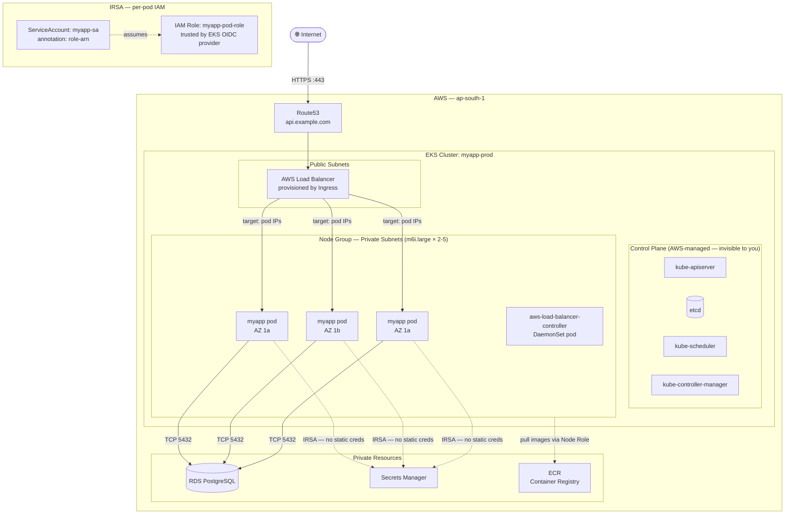
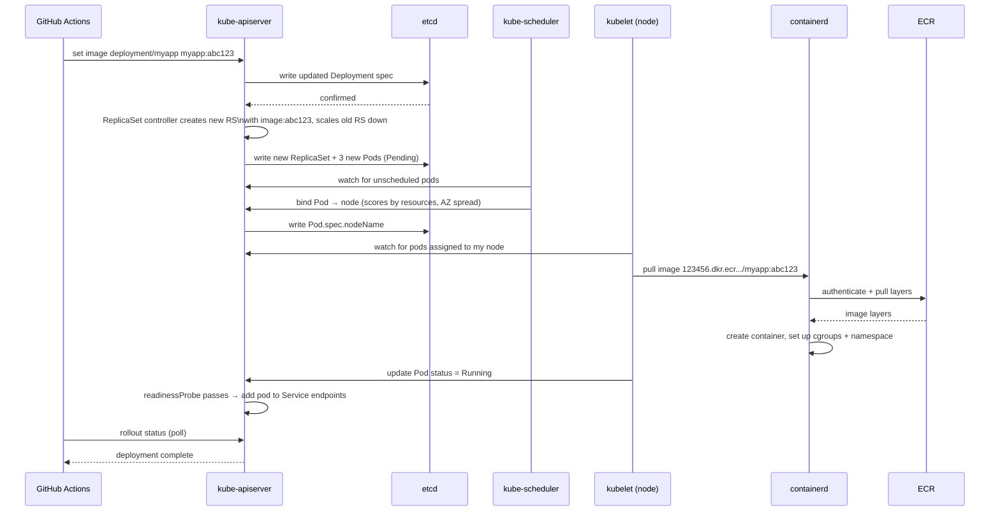

# AWS: EKS Deployment Example

> **The Anvaya:** *EKS is EC2 with a managed Kubernetes brain — the control plane is AWS's problem; your job is to define workloads and give pods the IAM permissions they need.*

## 🪝 The Hook

Deploy the same Go API as the EC2 example, but now as Kubernetes `Deployment` + `Service` + `Ingress`, with all AWS integration done via IAM Roles for Service Accounts — no credentials anywhere in the cluster.

---

## **Target Architecture**



---

## **Step 1 — Create the EKS Cluster**

```bash
# Install eksctl if not present: https://eksctl.io
# This creates: VPC, subnets, node group, OIDC provider — in ~15min

eksctl create cluster \
  --name myapp-prod \
  --region ap-south-1 \
  --version 1.31 \
  --nodegroup-name app-nodes \
  --node-type m6i.large \
  --nodes-min 2 \
  --nodes-max 5 \
  --managed \
  --with-oidc \
  --tags Environment=prod,Team=platform

# Connect kubectl to the new cluster
aws eks update-kubeconfig --name myapp-prod --region ap-south-1
kubectl get nodes
# NAME                                           STATUS   ROLES    AGE
# ip-192-168-x-x.ap-south-1.compute.internal   Ready    <none>   2m
```

💡 **What `--with-oidc` does:** Creates an IAM OIDC identity provider for the cluster. This is the foundation that lets Kubernetes ServiceAccounts assume IAM roles (IRSA). Without it, pods can't get AWS credentials per-pod.

⚠️ **Pin your EKS version and update intentionally.** AWS marks EKS versions end-of-life ~14 months after release. When support ends, AWS force-upgrades your control plane. If add-ons (CoreDNS, kube-proxy, AWS CNI) aren't updated first, the forced upgrade breaks them. Subscribe to EKS release notifications and plan upgrades:

```bash
# Check current vs latest available:
aws eks describe-addon-versions --addon-name coredns | jq '.addons[].addonVersions[0].addonVersion'
# Upgrade control plane first, then node groups, then add-ons:
aws eks update-cluster-version --name myapp-prod --kubernetes-version 1.32
```

💡 **Managed Node Groups vs Fargate:** Managed node groups run EC2 — full control, DaemonSets work, GPU support, node access via SSM. Fargate is serverless pods — no node management, but no DaemonSets, no GPU, no `hostNetwork`, and each pod pays its own cold-start tax. Use managed node groups for anything non-trivial.

---

## **Step 2 — Install AWS Load Balancer Controller**

The AWS Load Balancer Controller is a Kubernetes add-on that watches `Ingress` resources and creates real ALBs in AWS.

```bash
# Create the IAM policy for the controller (download AWS's official policy)
curl -fsSLo /tmp/alb-controller-policy.json \
  https://raw.githubusercontent.com/kubernetes-sigs/aws-load-balancer-controller/main/docs/install/iam_policy.json

aws iam create-policy \
  --policy-name AWSLoadBalancerControllerIAMPolicy \
  --policy-document file:///tmp/alb-controller-policy.json

ACCOUNT_ID=$(aws sts get-caller-identity --query Account --output text)

# Create a ServiceAccount with an IAM Role via IRSA
eksctl create iamserviceaccount \
  --cluster myapp-prod \
  --namespace kube-system \
  --name aws-load-balancer-controller \
  --attach-policy-arn arn:aws:iam::$ACCOUNT_ID:policy/AWSLoadBalancerControllerIAMPolicy \
  --approve

# Install the controller via Helm
helm repo add eks https://aws.github.io/eks-charts && helm repo update

helm install aws-load-balancer-controller eks/aws-load-balancer-controller \
  --namespace kube-system \
  --set clusterName=myapp-prod \
  --set serviceAccount.create=false \
  --set serviceAccount.name=aws-load-balancer-controller

kubectl -n kube-system get deployment aws-load-balancer-controller
```

💡 **Share one ALB across multiple Ingress objects to save cost.** Each Ingress creates one ALB by default (~$20/month each). Use `IngressGroup` to merge multiple Ingresses onto one ALB:

```yaml
annotations:
  alb.ingress.kubernetes.io/group.name: "shared-prod"   # All Ingresses with this group share one ALB
  alb.ingress.kubernetes.io/group.order: "10"            # Priority for rule ordering
```

One ALB handles all your services — path rules are merged. 10 services = 1 ALB, not 10.

---

## **Step 3 — IRSA for the Application**

```bash
ACCOUNT_ID=$(aws sts get-caller-identity --query Account --output text)

# Create IAM policy for the app (read secrets & write to S3)
cat > /tmp/myapp-policy.json << 'EOF'
{
  "Statement": [
    {"Effect":"Allow","Action":["secretsmanager:GetSecretValue"],
     "Resource":"arn:aws:secretsmanager:ap-south-1:*:secret:myapp/*"},
    {"Effect":"Allow","Action":["s3:GetObject","s3:PutObject"],
     "Resource":"arn:aws:s3:::myapp-prod-data/*"}
  ]
}
EOF

aws iam create-policy --policy-name myapp-pod-policy \
  --policy-document file:///tmp/myapp-policy.json

# Create Kubernetes ServiceAccount bound to the IAM Role
eksctl create iamserviceaccount \
  --cluster myapp-prod \
  --namespace production \
  --name myapp-sa \
  --attach-policy-arn arn:aws:iam::$ACCOUNT_ID:policy/myapp-pod-policy \
  --approve

# Verify: the ServiceAccount has the IAM role annotation
kubectl -n production describe sa myapp-sa | grep eks.amazonaws.com
# eks.amazonaws.com/role-arn: arn:aws:iam::123456:role/eksctl-myapp-prod-...
```

⚠️ **IRSA projected tokens expire.** The token at `/var/run/secrets/eks.amazonaws.com/serviceaccount/token` is a projected service account token with a default TTL of 24 hours (minimum 1 hour). The kubelet auto-rotates it before expiry. But if your app reads the token once at startup and caches it, it will fail after 24 hours. Use the AWS SDK's automatic credential refresh — it re-reads the token file on each call. Never cache the raw JWT.

💡 **Use `eksctl create iamserviceaccount` over manual OIDC trust policies.** Manual OIDC trust policy setup is error-prone (wrong audience, wrong subject claim). `eksctl` generates the exact trust policy with the correct OIDC provider ARN and `sub` condition. If pods get `AccessDenied` from IRSA, check the trust policy's `StringEquals` condition matches exactly:

```bash
# The trust policy condition must be:
# "sts.amazonaws.com": "system:serviceaccount:production:myapp-sa"
aws iam get-role --role-name myapp-pod-role | jq '.Role.AssumeRolePolicyDocument'
```

```

---

## **Step 4 — Kubernetes Manifests**

```bash
kubectl create namespace production
```

```yaml
# k8s/deployment.yml
apiVersion: apps/v1
kind: Deployment
metadata:
  name: myapp
  namespace: production
spec:
  replicas: 3
  selector:
    matchLabels:
      app: myapp
  strategy:
    type: RollingUpdate
    rollingUpdate:
      maxUnavailable: 1     # Never go below 2 running pods during deploy
      maxSurge: 1           # Temporarily run up to 4 pods during deploy
  template:
    metadata:
      labels:
        app: myapp
    spec:
      serviceAccountName: myapp-sa   # ← This gives pods the IAM role via IRSA

      containers:
        - name: myapp
          image: 123456789.dkr.ecr.ap-south-1.amazonaws.com/myapp:latest
          ports:
            - containerPort: 8080
          env:
            - name: DB_HOST
              value: "myapp-postgres.cluster-xxx.ap-south-1.rds.amazonaws.com"
            - name: AWS_REGION
              value: "ap-south-1"
            # DB_PASSWORD is NOT here — the app reads it from Secrets Manager at startup
            # using the IRSA credentials automatically injected by AWS SDK
          resources:
            requests:
              cpu: "250m"
              memory: "256Mi"
            limits:
              cpu: "500m"
              memory: "512Mi"
          readinessProbe:
            httpGet:
              path: /healthz
              port: 8080
            initialDelaySeconds: 5
            periodSeconds: 10
          livenessProbe:
            httpGet:
              path: /healthz
              port: 8080
            initialDelaySeconds: 15
            periodSeconds: 20

      topologySpreadConstraints:   # Spread pods across AZs
        - maxSkew: 1
          topologyKey: topology.kubernetes.io/zone
          whenUnsatisfiable: DoNotSchedule
          labelSelector:
            matchLabels:
              app: myapp
```

```yaml
# k8s/service.yml
apiVersion: v1
kind: Service
metadata:
  name: myapp
  namespace: production
spec:
  selector:
    app: myapp
  ports:
    - port: 80
      targetPort: 8080
  type: ClusterIP    # Internal only — ALB talks to pods directly via Ingress
```

```yaml
# k8s/ingress.yml
apiVersion: networking.k8s.io/v1
kind: Ingress
metadata:
  name: myapp
  namespace: production
  annotations:
    kubernetes.io/ingress.class: alb
    alb.ingress.kubernetes.io/scheme: internet-facing
    alb.ingress.kubernetes.io/target-type: ip          # Direct pod IP targeting (not node)
    alb.ingress.kubernetes.io/listen-ports: '[{"HTTPS":443}]'
    alb.ingress.kubernetes.io/certificate-arn: "arn:aws:acm:ap-south-1:123456:certificate/xxx"
    alb.ingress.kubernetes.io/ssl-redirect: "443"
    alb.ingress.kubernetes.io/healthcheck-path: /healthz
spec:
  rules:
    - host: api.example.com
      http:
        paths:
          - path: /
            pathType: Prefix
            backend:
              service:
                name: myapp
                port:
                  number: 80
```

```bash
kubectl apply -f k8s/
# deployment.apps/myapp created
# service/myapp created
# ingress.networking.k8s.io/myapp created

# Preview changes first (catch unintended mutations):
kubectl diff -f k8s/   # exit code 1 if differences, 0 if no changes

# Watch pods come up
kubectl -n production get pods -w

# Get the ALB DNS name (takes ~2min to provision)
kubectl -n production get ingress myapp
# ADDRESS: k8s-xxx.ap-south-1.elb.amazonaws.com  ← ALB auto-created!
```

💡 **`topologySpreadConstraints` prevents the "all pods on one node" failure mode.** Without spread constraints, the scheduler may place all 3 replicas on the same node (valid from a scheduling standpoint). If that node's EC2 is terminated, all pods disappear simultaneously. The spread constraint forces a maximum skew of 1 across AZs.

```

---

## **Step 5 — Route53 DNS**

```bash
ALB_DNS=$(kubectl -n production get ingress myapp -o jsonpath='{.status.loadBalancer.ingress[0].hostname}')
HOSTED_ZONE_ID=$(aws route53 list-hosted-zones-by-name --dns-name example.com \
  --query 'HostedZones[0].Id' --output text | cut -d/ -f3)

# Get the ALB's hosted zone ID
ALB_ARN=$(aws elbv2 describe-load-balancers \
  --query "LoadBalancers[?DNSName=='$ALB_DNS'].LoadBalancerArn" --output text)
ALB_HZ=$(aws elbv2 describe-load-balancers --load-balancer-arns $ALB_ARN \
  --query 'LoadBalancers[0].CanonicalHostedZoneId' --output text)

aws route53 change-resource-record-sets \
  --hosted-zone-id $HOSTED_ZONE_ID \
  --change-batch "{\"Changes\":[{\"Action\":\"UPSERT\",\"ResourceRecordSet\":{
    \"Name\":\"api.example.com\",\"Type\":\"A\",
    \"AliasTarget\":{\"HostedZoneId\":\"$ALB_HZ\",
      \"DNSName\":\"$ALB_DNS\",\"EvaluateTargetHealth\":true}}}]}"
```

---

## **Step 6 — Continuous Deployment from GitHub Actions**

```yaml
# .github/workflows/deploy.yml
on:
  push:
    branches: [main]

permissions:
  id-token: write
  contents: read

jobs:
  deploy:
    runs-on: ubuntu-24.04
    steps:
      - uses: actions/checkout@11bd71901bbe5b1630ceea73d27597364c9af683

      - name: Configure AWS (OIDC — no stored credentials)
        uses: aws-actions/configure-aws-credentials@e3dd6a429d7300a6a4c196c26e071d42e0343502
        with:
          role-to-assume: arn:aws:iam::123456:role/github-actions-deploy
          aws-region: ap-south-1

      - name: Login to ECR
        id: ecr
        uses: aws-actions/amazon-ecr-login@062b18b96a7aff071d4dc91bc00c4c1a7945b076

      - name: Build & push
        run: |
          TAG=${{ github.sha }}
          docker build -t ${{ steps.ecr.outputs.registry }}/myapp:$TAG .
          docker push ${{ steps.ecr.outputs.registry }}/myapp:$TAG

      - name: Update kubeconfig
        run: aws eks update-kubeconfig --name myapp-prod --region ap-south-1

      - name: Rolling deploy
        run: |
          kubectl -n production set image deployment/myapp \
            myapp=${{ steps.ecr.outputs.registry }}/myapp:${{ github.sha }}
          kubectl -n production rollout status deployment/myapp --timeout=5m
```

---

## **What Happens on `kubectl apply`**



---

## **Scaling & Autoscaling**

```bash
# Manual scale
kubectl -n production scale deployment myapp --replicas=5

# Horizontal Pod Autoscaler (scale on CPU)
kubectl -n production autoscale deployment myapp \
  --cpu-percent=60 --min=3 --max=10

# Cluster Autoscaler (add/remove EC2 nodes)
# eksctl auto-installs this. Triggered when pods are Pending due to insufficient resources.

# Verify HPA
kubectl -n production get hpa
# NAME    REFERENCE             TARGETS   MINPODS   MAXPODS   REPLICAS
# myapp   Deployment/myapp      42%/60%   3         10        4
```

---

## 🔒 Security Checklist

* ✅ IRSA: each pod gets its own scoped IAM role — no node-level credential sharing
* ✅ `serviceAccountName` is explicit — no pod inherits excessive node permissions
* ✅ Ingress `target-type: ip` — ALB talks directly to pods, bypasses NodePort
* ✅ `topologySpreadConstraints` — pods spread across AZs, not piled on one node
* ✅ `readinessProbe` — pods only receive traffic when healthy
* ✅ `resources.requests/limits` — pods can't starve the node of CPU/memory
* ✅ GitHub Actions OIDC — no AWS credentials stored in GitHub Secrets

### Hard-Learnt Nuggets

💡 **Enable EKS control plane audit logs — they're off by default.** Without audit logs, you have no visibility into who called the API, what was changed, and when. Critical for incident response:

```bash
aws eks update-cluster-config --name myapp-prod \
  --logging '{"clusterLogging":[{"types":["audit","authenticator","api","controllerManager","scheduler"],"enabled":true}]}'
# Logs ship to CloudWatch Logs: /aws/eks/myapp-prod/cluster
```

⚠️ **EKS node IAM roles are over-permissioned by default.** The node group IAM role gets `AmazonEKS_CNI_Policy` and `AmazonEC2ContainerRegistryReadOnly`. If a pod on a node gets shell access (via a vulnerability), it can use the node's instance metadata to call any AWS API the node role allows. Restrict via:

1. `automountServiceAccountToken: false` on pods that don't need K8s API access
2. IMDSv2 `http-put-response-hop-limit: 1` on EC2 launch template — prevents pods calling IMDS (they're 2 hops away)
3. Use IAM Roles for Service Accounts (IRSA) for all AWS access from pods — never the node role

💡 **EKS add-ons (VPC CNI, CoreDNS, kube-proxy) are separate from the control plane version.** After a cluster upgrade, the add-ons may be running versions incompatible with the new control plane. Always update add-ons immediately after upgrading the cluster:

```bash
aws eks update-addon --cluster-name myapp-prod --addon-name coredns \
  --addon-version v1.11.4-eksbuild.2 --resolve-conflicts OVERWRITE
```
