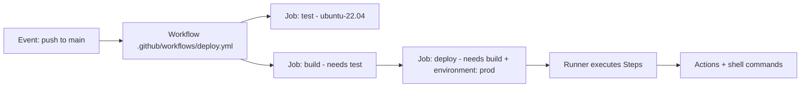

# GitHub Actions: From Zero to Production

> **The Anvaya:** *A workflow is not a script; it is a graph of jobs that runs in response to events, with the platform managing concurrency, secrets, and runners for you.*

## 🪝 The Hook

Your team manually deploys by SSH-ing into prod, running `git pull`, and praying. One person forgets to run migrations on a Friday. GitHub Actions replaces the prayer with a repeatable, auditable, policy-enforced pipeline.

---

## **Architecture Overview**



A **Workflow** [[?](Concepts.md#workflow)] is triggered by an **Event** [[?](Concepts.md#event)]. It runs one or more **Jobs** [[?](Concepts.md#job)] on **Runners** [[?](Concepts.md#runner)]. Each Job runs **Steps** [[?](Concepts.md#step)] sequentially.

---

## **Phase 1: The Absolute Minimum**

**Goal:** A working CI pipeline that runs on every push.

```yaml
# .github/workflows/ci.yml
name: CI

on: [push]         # Trigger on every push to any branch

jobs:
  test:
    runs-on: ubuntu-24.04   # GitHub-hosted runner

    steps:
      - name: Checkout code
        uses: actions/checkout@v4   # Clone the repo

      - name: Run tests
        run: |
          echo "Running tests..."
          go test ./...
```

**What You Learned:**

* ✅ Workflows live in `.github/workflows/`. GitHub auto-discovers any `.yml` file there.
* ✅ `on:` defines the trigger. `jobs:` defines parallelizable units of work.
* ✅ `runs-on:` picks the runner OS. Pin to a specific version (`ubuntu-24.04`), not `ubuntu-latest` (it changes).
* ✅ `uses:` runs a published **Action** [[?](Concepts.md#action)]. `run:` executes shell commands.

⚠️ **ANTI-PATTERN: `runs-on: ubuntu-latest`**
`ubuntu-latest` is an alias that GitHub updates periodically. A runner upgrade can silently break your builds. Pin to `ubuntu-24.04` and upgrade intentionally.

💡 **TIP: `actions/checkout@v4`**
Always run `actions/checkout` as the first step. Without it, the runner has an empty workspace — your code is not there by default.

---

## **Phase 2: Triggers & Conditions**

**Goal:** Run the right workflow at the right time.

```yaml
on:
  push:
    branches: [main, "release/**"]   # Only pushes to main or release/* branches
    paths-ignore: ["**.md", "docs/**"]  # Skip if only docs changed

  pull_request:
    branches: [main]                 # PRs targeting main
    types: [opened, synchronize, reopened]

  schedule:
    - cron: "0 2 * * 1"             # Every Monday at 02:00 UTC (dependency audit)

  workflow_dispatch:                 # Manual button in GitHub UI
    inputs:
      environment:
        description: "Target environment"
        required: true
        default: "staging"
        type: choice
        options: [staging, prod]

  workflow_call:                     # Called by another workflow (reusable)
    inputs:
      version:
        type: string
        required: true
    secrets:
      deploy_token:
        required: true
```

**Conditional Job Execution:**

```yaml
jobs:
  deploy:
    runs-on: ubuntu-24.04
    # Only deploy from main branch, never from PRs
    if: github.ref == 'refs/heads/main' && github.event_name == 'push'
    steps:
      - run: echo "Deploying to production..."
```

**What You Learned:**

* ✅ `paths-ignore` prevents CI from running on README edits — saves runner minutes.
* ✅ `workflow_dispatch` adds a manual "Run workflow" button in the Actions UI with typed inputs.
* ✅ `workflow_call` makes a workflow **reusable** — callable from other workflows.
* ✅ `if:` conditions on jobs/steps use **Expression syntax** [[?](Concepts.md#expressions)] — evaluated before the job starts.

💡 **TIP: `pull_request` triggers and fork security**
Workflows triggered by PRs from forks run with **read-only** `GITHUB_TOKEN` and no secrets access. This is a security feature. Use `pull_request_target` only if you understand the security implications (it runs in the context of the *base* repo and has secret access).

⚠️ **ANTI-PATTERN: `on: push` with no branch filter**
Without a branch filter, every push to every branch — including `wip/`, `experimental/` — triggers your expensive deploy workflow. Always filter to `branches: [main]` for deploy workflows.

---

## **Phase 3: Jobs, Needs & Outputs**

**Goal:** Chain jobs and pass data between them.

```yaml
jobs:
  build:
    runs-on: ubuntu-24.04
    outputs:
      image_tag: ${{ steps.tag.outputs.tag }}   # Expose step output as job output

    steps:
      - uses: actions/checkout@v4

      - name: Compute image tag
        id: tag                                  # Give step an ID to reference its outputs
        run: echo "tag=$(git rev-parse --short HEAD)" >> $GITHUB_OUTPUT

      - name: Build Docker image
        run: docker build -t myapp:${{ steps.tag.outputs.tag }} .

  deploy:
    runs-on: ubuntu-24.04
    needs: [build]                               # Waits for 'build' to succeed
    # Access previous job's output via needs context
    env:
      IMAGE_TAG: ${{ needs.build.outputs.image_tag }}

    steps:
      - run: echo "Deploying image: $IMAGE_TAG"
```

**What You Learned:**

* ✅ `needs: [job_name]` creates a dependency edge. The dependent job runs only after all listed jobs succeed.
* ✅ Passing data between jobs requires **two declarations**: `outputs:` on the source job AND the step writing to `$GITHUB_OUTPUT`.
* ✅ Access prior job data via `${{ needs.<job_id>.outputs.<name> }}`.

💡 **TIP: `$GITHUB_OUTPUT` vs `::set-output`**
The old `echo "::set-output name=tag::value"` syntax is **deprecated and disabled**. Always use:

```bash
echo "tag=$(git rev-parse --short HEAD)" >> $GITHUB_OUTPUT
```

⚠️ **ANTI-PATTERN: Using environment files for cross-job data**
`$GITHUB_ENV` sets environment variables for subsequent *steps in the same job*. It does **not** cross job boundaries. Use `$GITHUB_OUTPUT` + job `outputs:` for cross-job data.

---

## **Phase 4: Secrets, Variables & OIDC**

**Goal:** Authenticate to cloud providers without storing long-lived credentials.

**The hierarchy:**

| Source | Scope | Use for |
| :--- | :--- | :--- |
| `secrets.*` | Org → Repo → Env | Passwords, tokens, keys — never logged |
| `vars.*` | Org → Repo → Env | Non-secret config (region, image name) |
| `env:` in YAML | Workflow → Job → Step | Derived values, not secrets |

**Basic secret usage:**

```yaml
jobs:
  deploy:
    runs-on: ubuntu-24.04
    steps:
      - name: Deploy
        env:
          # Map secret into step env; never use ${{ secrets.X }} directly in run: scripts
          DEPLOY_TOKEN: ${{ secrets.DEPLOY_TOKEN }}
        run: ./deploy.sh   # Script reads $DEPLOY_TOKEN from env
```

**OIDC — The Right Way to Authenticate to AWS/GCP (No Long-Lived Keys):**
**OIDC** (OpenID Connect — keyless cloud auth) [[?](Concepts.md#oidc)] lets GitHub Actions prove its identity to your cloud provider without any stored credentials.

```yaml
jobs:
  deploy:
    runs-on: ubuntu-24.04
    permissions:
      id-token: write   # Required for OIDC — request a JWT from GitHub
      contents: read

    steps:
      - uses: actions/checkout@v4

      - name: Configure AWS credentials via OIDC
        uses: aws-actions/configure-aws-credentials@v4
        with:
          role-to-assume: arn:aws:iam::123456789:role/github-actions-deploy
          aws-region: us-east-1
          # No access_key_id or secret_access_key needed!

      - name: Deploy
        run: aws s3 sync ./dist s3://my-prod-bucket
```

**What You Learned:**

* ✅ **Never** store AWS/GCP credentials as GitHub Secrets. Use OIDC.
* ✅ OIDC requires `permissions: id-token: write` on the job.
* ✅ Use `env:` on the step (not inline `${{ secrets.X }}` in `run:`) to prevent secrets appearing in debug logs.
* ✅ `vars.*` is for non-sensitive config: `${{ vars.AWS_REGION }}`, `${{ vars.IMAGE_REPO }}`.

✨ **BEST PRACTICE: Minimal `permissions`**
GitHub Actions defaults to permissive `GITHUB_TOKEN` scopes. Declare minimal permissions explicitly at the workflow or job level to apply least privilege:

```yaml
permissions:        # Workflow-level: applies to all jobs
  contents: read    # Read code
  packages: write   # Push to GHCR

jobs:
  deploy:
    permissions:    # Job-level: OVERRIDES workflow-level for this job
      id-token: write
      contents: read
```

⚠️ **ANTI-PATTERN: Inline secrets in `run:` commands**

```yaml
# ❌ This leaks the token in the workflow logs if debug mode is on
run: curl -H "Authorization: Bearer ${{ secrets.API_TOKEN }}" https://api.example.com

# ✅ Map to env variable first
env:
  API_TOKEN: ${{ secrets.API_TOKEN }}
run: curl -H "Authorization: Bearer $API_TOKEN" https://api.example.com
```

---

## **Phase 5: Reusable Workflows & Composite Actions**

**Goal:** Stop copy-pasting the same 20 steps across 5 workflows.

**Reusable Workflow** [[?](Concepts.md#reusable-workflow)] — a complete workflow called from another:

```yaml
# .github/workflows/_deploy.yml  (underscore prefix = "private" by convention)
name: Deploy (Reusable)

on:
  workflow_call:
    inputs:
      environment:
        type: string
        required: true
      image_tag:
        type: string
        required: true
    secrets:
      deploy_key:
        required: true

jobs:
  deploy:
    runs-on: ubuntu-24.04
    environment: ${{ inputs.environment }}
    steps:
      - run: ./deploy.sh ${{ inputs.image_tag }}
        env:
          DEPLOY_KEY: ${{ secrets.deploy_key }}
```

```yaml
# .github/workflows/prod-deploy.yml  (the caller)
jobs:
  call-deploy:
    uses: ./.github/workflows/_deploy.yml
    with:
      environment: prod
      image_tag: ${{ needs.build.outputs.image_tag }}
    secrets:
      deploy_key: ${{ secrets.PROD_DEPLOY_KEY }}
    # OR: secrets: inherit  ← passes ALL caller secrets to the reusable workflow
```

**Composite Action** [[?](Concepts.md#composite-action)] — reusable steps within a single job:

```yaml
# .github/actions/setup-go/action.yml
name: "Setup Go with Cache"
description: "Install Go and restore module cache"

inputs:
  go-version:
    description: "Go version to use"
    required: true
    default: "1.22"

runs:
  using: composite
  steps:
    - uses: actions/setup-go@v5
      with:
        go-version: ${{ inputs.go-version }}
        cache: true
```

```yaml
# Used in any workflow:
- uses: ./.github/actions/setup-go
  with:
    go-version: "1.22"
```

**What You Learned:**

* ✅ **Reusable workflow:** Cross-workflow reuse. Has its own runner, full job isolation, passes secrets explicitly.
* ✅ **Composite action:** In-job reuse. Runs within the calling job's runner. Lighter weight.
* ✅ `secrets: inherit` passes all secrets from caller to reusable workflow — convenient but reduces explicitness.
* ✅ Prefix private reusable workflows with `_` to signal "not meant to be triggered directly."

---

## **Phase 6: Matrix Builds & Parallelism**

**Goal:** Test across multiple OS/versions in parallel without duplicating jobs.

```yaml
jobs:
  test:
    runs-on: ${{ matrix.os }}
    strategy:
      fail-fast: false     # Don't cancel other matrix jobs if one fails — see all failures
      matrix:
        os: [ubuntu-24.04, macos-14, windows-2022]
        go: ["1.21", "1.22"]
        exclude:
          - os: windows-2022
            go: "1.21"     # Skip this specific combination
        include:
          - os: ubuntu-24.04
            go: "1.22"
            RACE: true     # Add an extra variable for this one combination

    steps:
      - uses: actions/checkout@v4
      - uses: actions/setup-go@v5
        with:
          go-version: ${{ matrix.go }}
      - run: go test ${{ matrix.RACE && '-race' || '' }} ./...
```

**What You Learned:**

* ✅ Matrix creates one job per combination. 3 OS × 2 Go versions = 6 parallel jobs.
* ✅ `fail-fast: false` is the production setting — see all failures, don't guess which combination broke.
* ✅ `exclude:` drops specific combinations. `include:` adds combinations or extra variables.
* ✅ `matrix.RACE` is `null` for jobs that didn't declare it — use the ternary `&&` / `||` pattern for conditionals.

💡 **TIP: Matrix for deploy environments**

```yaml
matrix:
  include:
    - environment: staging
      url: https://staging.example.com
    - environment: prod
      url: https://example.com
```

Use `needs:` + `if:` to gate the prod matrix entry behind an approval.

---

## **Phase 7: Caching & Artifacts**

**Goal:** Make workflows fast (cache deps) and preserve build outputs between jobs.

**Dependency Cache:**

```yaml
- name: Cache Go modules
  uses: actions/cache@v4
  with:
    path: |
      ~/.cache/go-build
      ~/go/pkg/mod
    # Key: changes only when go.sum changes → cache miss only when deps change
    key: ${{ runner.os }}-go-${{ hashFiles('**/go.sum') }}
    restore-keys: |
      ${{ runner.os }}-go-         # Fallback: restore nearest old cache
```

**Artifacts (pass files between jobs, or download after workflow):**

```yaml
jobs:
  build:
    steps:
      - run: go build -o bin/app ./...
      - uses: actions/upload-artifact@v4
        with:
          name: app-binary-${{ github.sha }}
          path: bin/
          retention-days: 7         # Don't keep forever; storage costs money

  deploy:
    needs: [build]
    steps:
      - uses: actions/download-artifact@v4
        with:
          name: app-binary-${{ github.sha }}
          path: bin/
      - run: ./bin/app --version
```

**What You Learned:**

* ✅ **Cache** persists between workflow runs. **Artifact** shares files within a single workflow run.
* ✅ Cache key with `hashFiles('**/go.sum')` ensures a miss when deps change, hit when they don't.
* ✅ `restore-keys:` is a prefix fallback — uses the most recent matching cache when exact key misses.
* ✅ Set `retention-days:` on artifacts. GitHub stores them for 90 days by default, and it adds up.

⚠️ **ANTI-PATTERN: Caching build outputs (compiled binaries)**
Cache is for *inputs* (node_modules, Go module cache). Don't cache *outputs* (compiled binaries). Use Artifacts for outputs. A stale binary cache is harder to debug than a slow build.

---

## **Phase 8: Environments & Deployment Protection**

**Goal:** Gate production deployments behind manual approval.

**Create the Environment in GitHub UI:** Settings → Environments → New → `prod` → Add required reviewers.

```yaml
jobs:
  deploy-prod:
    runs-on: ubuntu-24.04
    environment:
      name: prod
      url: https://example.com    # Shown in the deployment status UI

    steps:
      - run: echo "This step pauses until a required reviewer approves"
      - run: ./deploy.sh prod
```

**Environment-scoped secrets:**
Secrets set on the `prod` Environment are only available to jobs that declare `environment: prod`. They are isolated from all other jobs — even other jobs in the same workflow run.

**What You Learned:**

* ✅ `environment: prod` triggers the protection rules (required reviewers, wait timer, branch restrictions).
* ✅ The workflow pauses at the job start until approval is given in the GitHub UI.
* ✅ Environment-scoped secrets override repo-scoped secrets of the same name.
* ✅ The `url:` field creates a "View deployment" link visible in PR status and the deployments tab.

💡 **TIP: Deployment preview URLs in PRs**
Set `url: ${{ steps.deploy.outputs.preview_url }}` to post a dynamic preview URL (Vercel/Netlify pattern) back to the PR. GitHub renders it as a clickable environment link.

---

## **Phase 9: Security Hardening**

**Goal:** Close the attack surface that GitHub Actions introduces.

**Pin Actions by SHA, not tag:**

```yaml
# ❌ Tag can be moved by the action author (supply chain attack)
- uses: actions/checkout@v4

# ✅ SHA is immutable. Verify SHA at https://www.github.com/actions/checkout
- uses: actions/checkout@11bd71901bbe5b1630ceea73d27597364c9af683  # v4.2.2
```

**Minimal `GITHUB_TOKEN` permissions:**

```yaml
# Workflow default: restrict everything
permissions:
  contents: read

jobs:
  release:
    permissions:
      contents: write    # Only this job can create releases
      packages: write    # Only this job can push to GHCR
```

**Prevent script injection via `github.event` data:**

```yaml
# ❌ PR title injected directly into shell — attacker names branch: "x; rm -rf /"
- run: echo "PR title: ${{ github.event.pull_request.title }}"

# ✅ Map to env variable first — shell treats it as data, not code
- env:
    PR_TITLE: ${{ github.event.pull_request.title }}
  run: echo "PR title: $PR_TITLE"
```

**What You Learned:**

* ✅ Pin all third-party actions by full commit SHA.
* ✅ Declare `permissions:` explicitly — never rely on defaults.
* ✅ Never interpolate `${{ github.event.* }}` directly into `run:` scripts. Always use `env:`.
* ✅ Use OIDC instead of long-lived credentials (see Phase 4).

✨ **BEST PRACTICE: Use `CODEOWNERS` for workflow changes**

```
# .github/CODEOWNERS
.github/workflows/  @your-org/platform-team
```

This requires platform team review for any workflow change — prevents privilege escalation by developers adding steps that exfiltrate secrets.

⚠️ **ANTI-PATTERN: `pull_request_target` + `actions/checkout` of PR code**
`pull_request_target` runs with write permissions and secret access. If you check out and run the PR's code in this context, an attacker's PR can steal all your secrets. Never do:

```yaml
on: pull_request_target
steps:
  - uses: actions/checkout@v4
    with:
      ref: ${{ github.event.pull_request.head.sha }}  # ❌ Runs attacker's code with your secrets
```

---

## 🔒 Security & Pitfalls

### 1. The `GH_TOKEN` Scope Creep

* **Pitfall:** `GITHUB_TOKEN` has `write` access to repo contents by default.
* **Fix:** Add `permissions: contents: read` at the top of every workflow. Escalate only where needed.

### 2. The Self-Hosted Runner Risk

* **Pitfall:** Self-hosted runners persist state between runs. A compromised workflow can leave malicious code that persists to the next run.
* **Fix:** Use ephemeral self-hosted runners (one-run containers). Never run self-hosted runners on public repos — any fork PR can execute code on your machine.

### 3. The Concurrency Stampede

* **Pitfall:** 10 commits to `main` in quick succession launch 10 deploy jobs. They race, and the oldest one might finish last, rolling back your newest code.
* **Fix:** Use `concurrency` groups:

    ```yaml
    concurrency:
      group: deploy-${{ github.ref }}
      cancel-in-progress: true   # Cancel older runs when a new one starts
    ```

### 4. The Missing `--no-pager` on Git Commands

* **Pitfall:** `git log` or `git diff` inside a workflow hangs the runner waiting for pager input.
* **Fix:** Always use `git --no-pager log` or set `GIT_PAGER=cat`.

---

## 🚀 Summary Checklist

* ✅ **Phase 1:** Workflow in `.github/workflows/`, triggered by `on: push`.
* ✅ **Phase 2:** Filter triggers with `branches:`, `paths-ignore:`. Use `workflow_dispatch:` for manual runs.
* ✅ **Phase 3:** Chain jobs with `needs:`. Pass data via `$GITHUB_OUTPUT` + job `outputs:`.
* ✅ **Phase 4:** Use OIDC for cloud auth. Never store long-lived keys. Use `env:` for secrets.
* ✅ **Phase 5:** Extract repeated logic into Reusable Workflows or Composite Actions.
* ✅ **Phase 6:** Matrix for cross-platform testing. Set `fail-fast: false`.
* ✅ **Phase 7:** Cache dep inputs; use Artifacts for build outputs.
* ✅ **Phase 8:** Gate prod deployments with `environment:` + required reviewer.
* ✅ **Phase 9:** Pin actions by SHA. Declare minimal `permissions:`. Never interpolate event data into shell.
