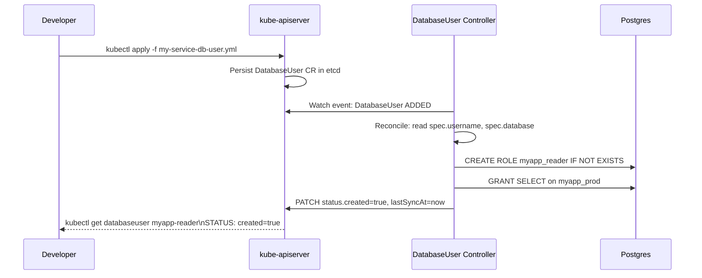

# Kubernetes: Concepts

> **The Anvaya:** *Kubernetes objects are persistent records of desired state; controllers are the agents that make reality match those records.*

---

## **<a id="yaml-anatomy"></a>Anatomy of a Kubernetes YAML**

> Every Kubernetes manifest is a structured declaration: "I want this kind of object, with this identity, and this desired state."

All Kubernetes resource YAMLs share the same four top-level fields:

```yaml
apiVersion: apps/v1          # ← Group + Version (see GVK below)
kind: Deployment             # ← The resource type
metadata:                    # ← Identity: name, namespace, labels, annotations
  name: myapp
  namespace: production
  labels:
    app: myapp
    version: "1.0"
  annotations:               # Non-identifying metadata. Consumed by tools, not the core scheduler.
    kubectl.kubernetes.io/last-applied-configuration: "..."
spec:                        # ← DESIRED state. You write this.
  replicas: 3
  selector:
    matchLabels:
      app: myapp
  # ... resource-specific fields ...
# status:                    # ← ACTUAL state. Kubernetes writes this. Never set it yourself.
#   availableReplicas: 3
#   conditions: [...]
```

- `metadata.labels` — key/value pairs for selection (Services, ReplicaSets select by label). Keep them short and stable.
- `metadata.annotations` — arbitrary metadata, typically consumed by tools (Helm, ArgoCD, ALB controller annotations).
- `spec` — the contract you make with the control plane. Submit desired state; watch controllers reconcile.
- `status` — read-only view of actual state. Never user-managed.

💡 **Generating YAML scaffolds instead of writing from scratch:**

```bash
# Deployment scaffold
kubectl create deployment myapp --image=myapp:latest --replicas=3 \
  --dry-run=client -o yaml > k8s/deployment.yml

# Service scaffold
kubectl create service clusterip myapp --tcp=80:8080 \
  --dry-run=client -o yaml > k8s/service.yml

# ConfigMap scaffold
kubectl create configmap myapp-config --from-file=config.yml \
  --dry-run=client -o yaml > k8s/configmap.yml

# CronJob scaffold
kubectl create cronjob report --image=myapp:latest \
  --schedule="0 2 * * *" --dry-run=client -o yaml > k8s/cronjob.yml
```

`--dry-run=client` never contacts the API server — it just renders the YAML locally. Pipe to a file, then edit only what you need.

⚠️ **Generated YAML has a lot of noise.** Delete fields with zero values (`terminationMessagePath`, `dnsPolicy`: `ClusterFirst` etc.) — they're defaults. Keep your manifests minimal — only spec what you consciously intend.

---

## **<a id="gvk"></a>Group / Version / Kind (GVK)**

> GVK is Kubernetes's type system — it maps a YAML type assertion to the Go struct that owns it.

The `apiVersion` field encodes `<group>/<version>`. The `kind` field completes the triple.

| apiVersion | Group | Version | Kind examples |
|---|---|---|---|
| `v1` | *core* (empty group) | `v1` | `Pod`, `Service`, `ConfigMap`, `Secret`, `PV`, `PVC`, `Namespace` |
| `apps/v1` | `apps` | `v1` | `Deployment`, `ReplicaSet`, `StatefulSet`, `DaemonSet` |
| `batch/v1` | `batch` | `v1` | `Job`, `CronJob` |
| `networking.k8s.io/v1` | `networking.k8s.io` | `v1` | `Ingress`, `NetworkPolicy` |
| `rbac.authorization.k8s.io/v1` | `rbac.authorization.k8s.io` | `v1` | `Role`, `ClusterRole`, `RoleBinding` |
| `storage.k8s.io/v1` | `storage.k8s.io` | `v1` | `StorageClass` |
| `autoscaling/v2` | `autoscaling` | `v2` | `HorizontalPodAutoscaler` |
| `apiextensions.k8s.io/v1` | `apiextensions.k8s.io` | `v1` | `CustomResourceDefinition` (CRD) |

```bash
# Discover all resources and their GVK in your cluster:
kubectl api-resources --verbs=list -o wide

# See all API versions a resource supports:
kubectl explain deployment --api-version=apps/v1
kubectl explain deployment.spec.template.spec.containers.resources
```

💡 **GVK + name + namespace = the unique address of any object in the cluster.** The URL in the REST API mirrors this exactly:

```
/apis/apps/v1/namespaces/production/deployments/myapp
        ^^^^^ ^^          ^^^^^^^^^^^ ^^^^^^^^^^^  ^^^^^
        group version     namespace   resource     name
```

---

## **<a id="client-go"></a>client-go — Talking to Kubernetes from Go**

> The official Go client for the Kubernetes API. Used for automation, controllers, operators, and tooling.

### Installation

```bash
go get k8s.io/client-go@latest
go get k8s.io/api@latest
go get k8s.io/apimachinery@latest
```

### Out-of-Cluster (local tooling / CI)

```go
import (
    "context"
    "fmt"
    "k8s.io/client-go/kubernetes"
    "k8s.io/client-go/tools/clientcmd"
    metav1 "k8s.io/apimachinery/pkg/apis/meta/v1"
)

func main() {
    // Loads ~/.kube/config (same as kubectl)
    cfg, _ := clientcmd.BuildConfigFromFlags("", clientcmd.RecommendedHomeFile)
    cs, _ := kubernetes.NewForConfig(cfg)

    pods, _ := cs.CoreV1().Pods("production").List(context.Background(), metav1.ListOptions{
        LabelSelector: "app=myapp",
    })
    for _, p := range pods.Items {
        fmt.Printf("%s  %s\n", p.Name, p.Status.Phase)
    }
}
```

### In-Cluster (running inside a pod)

```go
import "k8s.io/client-go/rest"

// Automatically uses the pod's ServiceAccount token at /var/run/secrets/...
cfg, _ := rest.InClusterConfig()
cs, _ := kubernetes.NewForConfig(cfg)
```

### The Informer Pattern — Efficient Watching

Never use `cs.CoreV1().Pods("").List()` in a control loop — it hammers the API server. Use an **Informer**:

```go
import (
    "k8s.io/client-go/informers"
    "k8s.io/client-go/tools/cache"
)

factory := informers.NewSharedInformerFactory(cs, 30*time.Second)
podInformer := factory.Core().V1().Pods()

podInformer.Informer().AddEventHandler(cache.ResourceEventHandlerFuncs{
    AddFunc: func(obj interface{}) {
        pod := obj.(*v1.Pod)
        fmt.Printf("Pod added: %s\n", pod.Name)
    },
    UpdateFunc: func(old, new interface{}) { /* ... */ },
    DeleteFunc: func(obj interface{}) { /* ... */ },
})

factory.Start(stopCh)
factory.WaitForCacheSync(stopCh)  // Wait for initial list to complete before processing events
```

The Informer does one `List` + one `Watch`. It caches objects in memory (the **Lister**) and delivers events via `AddEventHandler`. No polling, no thundering herd.

💡 **The Informer cache is eventually consistent.** Always check the cache (`Lister()`) for current state, not the raw API. Use `Get` on the Lister, not on the client.

---

## **<a id="custom-controller"></a>Custom Controller in Go — a Real Example**

> A controller watches a Custom Resource Definition (CRD) and reconciles the real world to match the desired state declared in the CR.

**Useful real-world use case:** A `DatabaseUser` CRD that automatically creates a Postgres role when a developer applies a YAML. Ops defines the password policy once in the controller; devs just declare the user they need.

### Step 1 — Define the CRD

```yaml
# crd.yml
apiVersion: apiextensions.k8s.io/v1
kind: CustomResourceDefinition
metadata:
  name: databaseusers.myorg.io
spec:
  group: myorg.io
  versions:
    - name: v1
      served: true
      storage: true
      schema:
        openAPIV3Schema:
          type: object
          properties:
            spec:
              type: object
              required: [database, username]
              properties:
                database: {type: string}
                username: {type: string}
                readOnly:
                  type: boolean
                  default: false
            status:
              type: object
              properties:
                created:    {type: boolean}
                lastSyncAt: {type: string}
  scope: Namespaced
  names:
    plural: databaseusers
    singular: databaseuser
    kind: DatabaseUser
```

```bash
kubectl apply -f crd.yml
# crd applied. Now you can create 'DatabaseUser' objects.
```

### Step 2 — A Developer Applies a CR

```yaml
# my-service-db-user.yml
apiVersion: myorg.io/v1
kind: DatabaseUser
metadata:
  name: myapp-reader
  namespace: production
spec:
  database: myapp_prod
  username: myapp_reader
  readOnly: true
```

### Step 3 — The Controller (Simplified)

```go
package main

import (
    "context"
    "database/sql"
    "fmt"
    "time"

    metav1 "k8s.io/apimachinery/pkg/apis/meta/v1"
    "k8s.io/apimachinery/pkg/runtime/schema"
    "k8s.io/client-go/dynamic"
    "k8s.io/client-go/dynamic/dynamicinformer"
    "k8s.io/client-go/rest"
    "k8s.io/client-go/tools/cache"
)

var dbUserGVR = schema.GroupVersionResource{
    Group: "myorg.io", Version: "v1", Resource: "databaseusers",
}

func main() {
    cfg, _ := rest.InClusterConfig()
    dynClient, _ := dynamic.NewForConfig(cfg)

    // Informer for DatabaseUser objects across all namespaces
    factory := dynamicinformer.NewDynamicSharedInformerFactory(dynClient, 30*time.Second)
    informer := factory.ForResource(dbUserGVR).Informer()

    stopCh := make(chan struct{})
    informer.AddEventHandler(cache.ResourceEventHandlerFuncs{
        AddFunc:    func(obj interface{}) { reconcile(dynClient, obj) },
        UpdateFunc: func(_, obj interface{}) { reconcile(dynClient, obj) },
        // Note: DeleteFunc would drop the Postgres role — implement with care
    })

    factory.Start(stopCh)
    factory.WaitForCacheSync(stopCh)
    <-stopCh
}

func reconcile(client dynamic.Interface, obj interface{}) {
    u := obj.(*unstructured.Unstructured)
    spec := u.Object["spec"].(map[string]interface{})

    username := spec["username"].(string)
    database := spec["database"].(string)
    readOnly, _ := spec["readOnly"].(bool)

    db := connectToPostgres(database)

    // Idempotent: CREATE ROLE IF NOT EXISTS
    if readOnly {
        db.Exec(fmt.Sprintf(`
            DO $$ BEGIN
              IF NOT EXISTS (SELECT FROM pg_roles WHERE rolname='%s')
              THEN CREATE ROLE %s LOGIN PASSWORD '%s'; END IF;
            END $$;
            GRANT CONNECT ON DATABASE %s TO %s;
            GRANT SELECT ON ALL TABLES IN SCHEMA public TO %s;
        `, username, username, generatePassword(), database, username, username))
    }

    // Update status
    patch := fmt.Sprintf(`{"status":{"created":true,"lastSyncAt":"%s"}}`, time.Now().Format(time.RFC3339))
    client.Resource(dbUserGVR).Namespace(u.GetNamespace()).
        Patch(context.Background(), u.GetName(), types.MergePatchType,
            []byte(patch), metav1.PatchOptions{}, "status")
}

// ... [connectToPostgres and generatePassword helpers redacted] ...
```

### The Controller Lifecycle Diagram



💡 **Why `dynamic.Interface` instead of typed client?** For CRDs that aren't in the core API, you need either `dynamic.Interface` (untyped) or a **generated typed client** (`code-generator`). The dynamic client works without codegen — good for controllers you write by hand. For production operators, generate types with `controller-gen` or use **controller-runtime** (the library behind `kubebuilder`).

✨ **BEST PRACTICE:** Use **kubebuilder** or **operator-sdk** for real controllers. They scaffold the CRD, RBAC, Webhook, and controller boilerplate, and use `controller-runtime` which handles leader election, work queues, exponential backoff, and metrics out of the box.

```bash
# Scaffold an operator project ready for production:
kubebuilder init --domain myorg.io --repo github.com/myorg/db-operator
kubebuilder create api --group myorg --version v1 --kind DatabaseUser
make generate   # generates deepcopy functions & CRD manifests
make manifests  # generates CRD YAML
```

---

## **<a id="pod"></a>Pod**

> The smallest deployable unit: one or more containers that share a network namespace, IPC namespace, and optionally volumes.

- All containers in a pod share the same IP address and `localhost`. Container A can reach container B on `localhost:8080`.
- Pods are ephemeral — when deleted, they are gone. Their state only persists if backed by a PVC.
- A pod's IP is valid only for that pod's lifetime. Never hardcode pod IPs — use Services.
- **Sidecar containers** (init containers, logging agents, proxy) run alongside the main container in the same pod, sharing the network and filesystem.

```yaml
apiVersion: v1
kind: Pod
metadata:
  name: myapp
  namespace: production
spec:
  containers:
    - name: myapp
      image: myapp:abc123
      ports:
        - containerPort: 8080
      resources:
        requests: {cpu: "250m", memory: "256Mi"}
        limits:   {cpu: "500m", memory: "512Mi"}
      readinessProbe:
        httpGet: {path: /healthz, port: 8080}
        initialDelaySeconds: 5
        periodSeconds: 10
  initContainers:               # Runs to completion BEFORE app containers start
    - name: db-wait
      image: busybox
      command: ['sh', '-c', 'until nc -z postgres 5432; do sleep 1; done']
```

---

## **<a id="container-runtime"></a>Container Runtime Interface (CRI)**

> The gRPC API between kubelet and the container runtime (containerd, CRI-O). Kubelet doesn't talk to Docker directly.

- `containerd` is the standard runtime since Docker's CRI support was removed in Kubernetes 1.24.
- `containerd` delegates to `runc` (the low-level OCI runtime) to actually create Linux namespaces and cgroups.
- **OCI (Open Container Initiative):** The standard that defines the image format and runtime spec. All CRI-compatible runtimes use OCI images. Your Docker-built image is an OCI image — it runs on any OCI runtime.

---

## **<a id="deployment"></a>Deployment**

> A controller that manages a set of identical pods via a ReplicaSet, enabling rolling updates and rollbacks.

- Creates and manages **ReplicaSets** — it never creates pods directly.
- Rolling update creates a new ReplicaSet, scales it up while scaling the old one down.
- Each update creates a new ReplicaSet revision. `kubectl rollout undo` scales the previous RS back up.
- **MaxUnavailable + MaxSurge** define the speed/safety tradeoff of the rolling update.

---

## **<a id="replicaset"></a>ReplicaSet**

> The low-level controller that maintains a stable set of replica Pods running at any given time.

- Owned by a Deployment. Rarely written directly.
- Uses a **label selector** to identify its pods. Any pod matching the selector is "claimed."
- If you manually delete a pod owned by an RS, the RS creates a replacement immediately.
- Old ReplicaSets from rollouts are kept (with `replicas: 0`) to enable rollback. They're GC'd after `revisionHistoryLimit` (default 10).

---

## **<a id="statefulset"></a>StatefulSet**

> A controller for stateful apps: stable pod names (`postgres-0`), stable DNS (`postgres-0.svc`), and per-pod PVCs.

- Pods are created in order (0, then 1, then 2) and deleted in reverse (2, 1, 0).
- A pod getting the same ordinal index on restart gets the **same PVC** — data survives restarts.
- Requires a **Headless Service** (`clusterIP: None`) for per-pod DNS entries.
- Use for: Postgres, MySQL, Kafka, Elasticsearch, Redis Sentinel — anything with leader/follower topology or sticky identity.

---

## **<a id="daemonset"></a>DaemonSet**

> A controller that runs exactly one pod per node (or per filtered set of nodes).

- Automatically creates a pod on new nodes when they join the cluster.
- Automatically deletes the pod when a node is removed.
- Used for: log shippers (Fluentd), metrics collectors (node-exporter), CNI plugins, CSI node plugins, Device Plugins.
- Can target specific nodes with `nodeSelector` or `affinity`.

---

## **<a id="service"></a>Service**

> A stable virtual IP + DNS name that load-balances traffic across matching pods.

- The Service's ClusterIP stays constant even as pods come and go beneath it.
- kube-proxy programs `iptables` (or IPVS) rules on every node: packets to `ClusterIP:port` are DNAT'd to a healthy pod IP.
- **Endpoints** object (auto-managed) is the list of pod IPs behind the service. When a pod becomes Ready, its IP is added. When it's removed, its IP is removed.
- Services and pods are decoupled via **label selectors** — there is no direct reference.

```yaml
apiVersion: v1
kind: Service
metadata:
  name: myapp
  namespace: production
spec:
  selector:
    app: myapp       # Routes to pods with this label
  ports:
    - port: 80
      targetPort: 8080
  type: ClusterIP    # Alternatives: NodePort, LoadBalancer, ExternalName
```

---

## **<a id="ingress"></a>Ingress**

> An API object that manages external HTTP/HTTPS access to services — routing by host + path.

- Ingress alone does nothing. An **Ingress Controller** (nginx-ingress, AWS LBC, Traefik) watches Ingress objects and implements the routing rules.
- On AWS, the AWS Load Balancer Controller creates ALBs from Ingress objects.
- Multiple Ingress objects can share one ALB (using `IngressGroup` annotation on AWS LBC) — reduces cost vs one ALB per service.
- **IngressClass** selects which controller handles a given Ingress object (if multiple controllers are installed).

---

## **<a id="configmap"></a>ConfigMap**

> A namespaced key-value store for non-sensitive configuration data.

- Keys can be simple strings or entire file contents.
- Consumed by pods as environment variables, command-line args, or mounted files.
- **Volume mount is preferred over env var** for large configs — the mounted file updates automatically when the ConfigMap changes (with ~1 min delay). Env vars only update on pod restart.
- Limited to 1 MiB of data.

---

## **<a id="secret"></a>Secret**

> A ConfigMap for sensitive data — base64-encoded (NOT encrypted by default).

- Base64 is encoding, not encryption. Anyone with `kubectl get secret -o yaml` can decode it.
- **Encryption at rest:** Enable in kube-apiserver with `--encryption-provider-config` to use AES or KMS (recommended on EKS/GKE).
- **Secrets Store CSI Driver:** Mounts secrets directly from AWS Secrets Manager / Vault into the pod filesystem — the secret never lives in etcd at all.
- Referenced by pods via `secretKeyRef` (specific key) or `secretRef` (all keys as env vars) or volume mount.

---

## **<a id="pv-pvc"></a>PersistentVolume & PersistentVolumeClaim**

> PV: a unit of storage provisioned in the cluster. PVC: a user's request for storage.

- **PVC → PV binding:** When a PVC is created, the control plane finds or provisions a PV matching the requested size, access mode, and StorageClass.
- **Access Modes:** `ReadWriteOnce` (one node), `ReadWriteMany` (many nodes), `ReadOnlyMany`. EBS is RWO-only; EFS supports RWX.
- **Reclaim Policy:** `Delete` (PV and backing storage deleted with PVC) or `Retain` (PV lingers, must be manually reclaimed).
- **volumeBindingMode: WaitForFirstConsumer** delays PV provisioning until a pod is scheduled — critical for topology-constrained storage (EBS is AZ-specific).

---

## **<a id="storageclass"></a>StorageClass**

> A template for dynamic PV provisioning — defines the provisioner, parameters, and reclaim policy.

- When a PVC references a StorageClass, the **external-provisioner** sidecar calls the CSI driver to create the actual volume.
- The `default` annotation on a StorageClass auto-applies to PVCs that don't specify one.
- Different classes for different tiers: `ebs-gp3` (default), `ebs-io2` (high-performance), `efs-sc` (shared).

---

## **<a id="namespace"></a>Namespace**

> A virtual cluster within the physical cluster — scopes resource names and applies RBAC/quota.

- Most Kubernetes objects are namespace-scoped. Exceptions: `Node`, `PersistentVolume`, `ClusterRole`, `StorageClass` — these are cluster-scoped.
- **Cross-namespace access:** Pods in namespace A can reach services in namespace B via the full DNS: `service-name.namespace.svc.cluster.local`.
- `kube-system`: reserved for Kubernetes components (CoreDNS, kube-proxy).
- `kube-public`: world-readable (rarely used except for cluster-info bootstrap).

---

## **<a id="rbac"></a>RBAC**

> Role-Based Access Control — defines who (subject) can perform which actions (verbs) on which resources.

- **Role/ClusterRole:** The permission set. `Role` is namespace-scoped; `ClusterRole` is cluster-wide.
- **RoleBinding/ClusterRoleBinding:** Binds a Role to a Subject (User, Group, or ServiceAccount).
- **Subject types:** `User` (human — cert or OIDC identity), `Group` (e.g., `system:masters`), `ServiceAccount` (in-cluster identity for pods).
- `kubectl auth can-i <verb> <resource> --as=<subject>` — test authorization without doing the action.

```yaml
# Role: namespace-scoped read access to pods and logs
apiVersion: rbac.authorization.k8s.io/v1
kind: Role
metadata:
  name: pod-reader
  namespace: production
rules:
  - apiGroups: [""]                    # "" = core group (Pod, Service, ConfigMap...)
    resources: ["pods", "pods/log"]
    verbs: ["get", "list", "watch"]
---
# RoleBinding: attach role to a ServiceAccount
apiVersion: rbac.authorization.k8s.io/v1
kind: RoleBinding
metadata:
  name: myapp-pod-reader
  namespace: production
subjects:
  - kind: ServiceAccount
    name: myapp-sa
    namespace: production
roleRef:
  kind: Role
  name: pod-reader
  apiGroup: rbac.authorization.k8s.io
```

```bash
# Audit: who can delete pods in production?
kubectl auth can-i delete pods -n production --as=system:serviceaccount:production:myapp-sa
```

---

## **<a id="serviceaccount"></a>ServiceAccount**

> An in-cluster identity for pods. Provides a JWT token for authenticating to kube-apiserver.

- Every namespace has a `default` ServiceAccount. All pods use it unless `serviceAccountName` is specified.
- The token is auto-mounted at `/var/run/secrets/kubernetes.io/serviceaccount/token`.
- On EKS, ServiceAccounts can be **annotated with an IAM Role ARN** (IRSA) to get AWS credentials.
- Set `automountServiceAccountToken: false` on pods that don't need API access — principle of least privilege.

```yaml
apiVersion: v1
kind: ServiceAccount
metadata:
  name: myapp-sa
  namespace: production
  annotations:
    eks.amazonaws.com/role-arn: arn:aws:iam::123456789:role/myapp-pod-role   # IRSA on EKS
automountServiceAccountToken: true
```

```yaml
# In Pod/Deployment spec: use it
spec:
  serviceAccountName: myapp-sa
  automountServiceAccountToken: true   # Set false if pod doesn't call K8s API or AWS APIs
```

---

## **<a id="hpa"></a>HorizontalPodAutoscaler (HPA)**

> Automatically scales pod replicas based on observed CPU, memory, or custom metrics.

- Requires **metrics-server** (or Prometheus adapter for custom metrics) to read resource usage.
- HPA control loop runs every 15 seconds. Scale-up is aggressive; scale-down is conservative (waits 5 min by default) to avoid thrash.
- `stabilizationWindowSeconds` controls the cooldown period. Set longer for scale-down if you have bursty traffic.
- **VPA (Vertical Pod Autoscaler):** Adjusts CPU/memory requests per pod (requires pod restart). Complementary to HPA — don't use both on the same metric.

```yaml
apiVersion: autoscaling/v2
kind: HorizontalPodAutoscaler
metadata:
  name: myapp
  namespace: production
spec:
  scaleTargetRef:
    apiVersion: apps/v1
    kind: Deployment
    name: myapp
  minReplicas: 3
  maxReplicas: 20
  metrics:
    - type: Resource
      resource:
        name: cpu
        target:
          type: Utilization
          averageUtilization: 60
  behavior:
    scaleDown:
      stabilizationWindowSeconds: 300    # Wait 5min before scaling down (avoid thrash)
      policies:
        - type: Pods
          value: 1
          periodSeconds: 60              # Remove at most 1 pod per minute on scale-down
```

---

## **<a id="network-policy"></a>NetworkPolicy**

> Firewall rules for pod-to-pod traffic at Layer 3/4. Enforced by the CNI plugin (Calico, Cilium).

- **Default behavior:** All pods can reach all other pods (flat network). NetworkPolicy makes it opt-in deny.
- A pod with NO NetworkPolicy selecting it has no restrictions.
- Policies are additive — if two policies match a pod, both are applied (union of allowed traffic).
- **Egress + Ingress:** You need BOTH sides to allow traffic (or set a default-deny baseline).
- Not all CNI plugins support NetworkPolicy — AWS VPC CNI requires the **VPC CNI Network Policy** add-on or Calico.

```yaml
# Default-deny all ingress in a namespace, then selectively allow
apiVersion: networking.k8s.io/v1
kind: NetworkPolicy
metadata:
  name: default-deny-ingress
  namespace: production
spec:
  podSelector: {}     # Selects ALL pods in the namespace
  policyTypes: [Ingress]
---
# Allow: only myapp can receive from api-gateway on port 8080
apiVersion: networking.k8s.io/v1
kind: NetworkPolicy
metadata:
  name: allow-api-gateway-to-myapp
  namespace: production
spec:
  podSelector:
    matchLabels:
      app: myapp
  policyTypes: [Ingress]
  ingress:
    - from:
        - podSelector:
            matchLabels:
              app: api-gateway
      ports:
        - port: 8080
```

---

## **<a id="probes"></a>Probes — readinessProbe, livenessProbe, startupProbe**

> Health checks run by kubelet to control traffic routing (readiness) and container restarts (liveness).

- **readinessProbe:** Kubelet only adds the pod to Service Endpoints (allows traffic) when this passes. If it fails, the pod is removed from Endpoints but NOT restarted.
- **livenessProbe:** If this fails `failureThreshold` times, kubelet OOMKills and restarts the container. On a stuck goroutine or deadlock, this is your recovery mechanism.
- **startupProbe:** Delays liveness checks during slow startup. Once it passes once, liveness takes over. For JVM/Python apps that take 60s to initialize: use `startupProbe` with a long `failureThreshold` instead of a high `initialDelaySeconds` on liveness.

```yaml
containers:
  - name: myapp
    readinessProbe:
      httpGet:
        path: /readyz          # Returns 200 when DB connection is established
        port: 8080
      initialDelaySeconds: 5   # Wait 5s after container starts before first check
      periodSeconds: 10        # Check every 10s
      successThreshold: 1      # 1 success needed to become Ready
      failureThreshold: 3      # 3 failures → remove from Endpoints

    livenessProbe:
      httpGet:
        path: /livez           # Returns 200 unless in deadlock/stuck state
        port: 8080
      initialDelaySeconds: 30  # Give app time to initialize before liveness starts
      periodSeconds: 20
      failureThreshold: 3      # 3 failures → restart container

    startupProbe:             # Use for slow-starting apps (JVM, Python ML models)
      httpGet:
        path: /readyz
        port: 8080
      failureThreshold: 30    # 30 × periodSeconds = 5min max startup time
      periodSeconds: 10       # Check every 10s during startup
```

⚠️ **A failing readinessProbe hides a broken pod, not fixes it.** If your container is actually stuck (deadlock), readiness failure keeps traffic away but doesn't restart the pod. Pair readiness with a liveness probe that fires after extended failures.

---

## **<a id="taint-toleration"></a>Taints & Tolerations**

> Taints repel pods from nodes; tolerations are a pod's explicit opt-in to a tainted node.

- A taint on a node says: "don't schedule pods here unless they tolerate me."
- Set taints to dedicate node groups for specific workloads (GPU, high-memory, spot instances).

```bash
# Taint a GPU node so only GPU workloads land on it
kubectl taint nodes gpu-node-1 workload=gpu:NoSchedule

# Remove a taint
kubectl taint nodes gpu-node-1 workload=gpu:NoSchedule-
```

```yaml
# Pod must declare the toleration to be scheduled on gpu-node-1
tolerations:
  - key: "workload"
    operator: "Equal"
    value: "gpu"
    effect: "NoSchedule"
```

| Effect | Existing Pods | New Pods |
|---|---|---|
| `NoSchedule` | Unaffected | Not scheduled |
| `PreferNoSchedule` | Unaffected | Avoided if possible |
| `NoExecute` | **Evicted** (unless they tolerate) | Not scheduled |

---

## **<a id="affinity"></a>Affinity & Anti-Affinity**

> Fine-grained scheduling rules based on node labels or other pods' presence.

- **nodeAffinity:** Schedule pod on nodes matching label conditions (like `nodeSelector` but with `In`, `NotIn`, `Exists` operators and `preferred` vs `required`).
- **podAffinity:** Schedule near pods with certain labels (co-locate for latency).
- **podAntiAffinity:** Spread pods away from each other (HA distribution across zones/nodes).

```yaml
affinity:
  # Node must be in ap-south-1a or ap-south-1b
  nodeAffinity:
    requiredDuringSchedulingIgnoredDuringExecution:
      nodeSelectorTerms:
        - matchExpressions:
            - key: topology.kubernetes.io/zone
              operator: In
              values: [ap-south-1a, ap-south-1b]

  # Strongly prefer NOT to be on a node that already has a myapp pod
  podAntiAffinity:
    preferredDuringSchedulingIgnoredDuringExecution:
      - weight: 100
        podAffinityTerm:
          labelSelector:
            matchLabels:
              app: myapp
          topologyKey: kubernetes.io/hostname   # Spread across nodes
```

💡 **`topologySpreadConstraints` is usually better than `podAntiAffinity` for spreading.** Anti-affinity is binary (allowed/blocked). Topology spread allows you to say "max skew of 1 replica across zones" — more flexible and doesn't block scheduling when the cluster is small.

---

## **<a id="resource-requests-limits"></a>Resource Requests & Limits**

> Requests = what the scheduler reserves. Limits = what the runtime enforces.

- **CPU requests:** Used by the scheduler to fit a pod on a node. CPU is a compressible resource — if over the limit, the process is throttled (not killed).
- **Memory requests:** Used for scheduling. Memory is NOT compressible — if over the limit, the container is OOMKilled (killed by the Linux kernel's OOM killer).
- **QoS classes:**
  - `Guaranteed`: requests == limits for all containers. Highest priority, last to be evicted.
  - `Burstable`: requests < limits or not all containers have limits. May be evicted if a `BestEffort` pod can't free enough memory.
  - `BestEffort`: no requests or limits at all. First to be evicted.
- Always set requests. Set limits too (memory limit = guaranteed OOM behavior; CPU limit is optional — throttling may be acceptable).

```yaml
resources:
  requests:
    cpu: "250m"       # 0.25 cores: what the scheduler reserves on the node
    memory: "256Mi"   # 256 MiB: scheduler reservation + eviction baseline
  limits:
    cpu: "500m"       # Throttled (never OOM killed) if exceeded
    memory: "512Mi"   # OOMKilled if exceeded (Linux kernel kills the process)
```

💡 **Start with requests-only (no limits) in dev, then dial in limits from actual usage.** Run `kubectl top pods` for a week and set limits to the P99 observed usage + 20% headroom.

⚠️ **CPU limits cause hidden throttling.** A pod with `cpu limit: 500m` running on a node with available CPU still gets throttled if it tries to burst above 500m — even if no other pods are competing. For latency-sensitive services, consider removing CPU limits entirely (only use requests). Memory limits should always be set.

---

## **<a id="csi"></a>CSI (Container Storage Interface)**

> The plugin standard that decouples storage drivers from the Kubernetes core. See [Kubernetes-Internals.md](Kubernetes-Internals.md) for the full lifecycle diagram.

- Two plugin types: **Controller Plugin** (one replica, calls cloud APIs to provision/attach) and **Node Plugin** (DaemonSet, calls `mount` on the node).
- **Key gRPC calls:** `CreateVolume`, `DeleteVolume`, `ControllerPublishVolume` (attach), `NodeStageVolume` (format+mount to staging), `NodePublishVolume` (bind-mount into pod).
- CSI drivers are installed as Helm charts and run alongside sidecars: `external-provisioner`, `external-attacher`, `node-driver-registrar`.

---

## **<a id="device-plugin"></a>Device Plugin**

> A plugin that exposes non-standard hardware (GPU, RDMA NIC, FPGA) as schedulable resources in Kubernetes.

- Registers with kubelet via gRPC socket at `/var/lib/kubelet/device-plugins/`.
- Implements `ListAndWatch()` (stream of available devices) and `Allocate()` (returns device file paths, env vars, and mounts to inject into the container).
- Kubelet updates `Node.status.capacity` with the device count, making it visible to the scheduler.
- Examples: `nvidia.com/gpu`, `amd.com/gpu`, `intel.com/rdma_rxe`, `kubernetes.io/rdma-vf`.
- Run as a DaemonSet with `privileged: true` and `hostNetwork: true` — it needs access to host device files.

---

## **<a id="etcd"></a>etcd**

> Distributed key-value store (Raft consensus) that holds all Kubernetes cluster state. The single source of truth.

- Only `kube-apiserver` talks to etcd directly — all other components go through the API.
- **Watch API:** etcd's long-poll watch is why controllers react in real time without polling.
- Keys follow the path: `/registry/<resource>/<namespace>/<name>`. E.g., `/registry/pods/production/myapp-0`.
- **Raft quorum:** 3-node etcd tolerates 1 failure. 5-node tolerates 2. Never run even-numbered clusters.
- On EKS/GKE/AKS: etcd is fully managed by the cloud provider — you never interact with it directly.

---

## **<a id="cni"></a>CNI (Container Network Interface)**

> The plugin standard for pod networking — assigns pod IPs, sets up veth pairs, programs routing.

- When kubelet starts a pod, it calls the CNI plugin to set up networking.
- CNI creates a virtual ethernet pair (veth): one end in the pod's network namespace, one end on the host.
- Assigns an IP from the cluster CIDR, sets routes so all pods can reach each other.
- **AWS VPC CNI:** assigns real VPC IPs to pods (no overlay). Pods are directly routable from VPC. Consequence: EKS pods consume ENI IP slots — plan IP space carefully.
- **Calico/Cilium:** overlay or direct, with NetworkPolicy support and eBPF-based data plane.

---

## **<a id="admission-controller"></a>Admission Controllers**

> Plugins that intercept API requests after auth/authz and before persistence — to mutate or validate objects.

- **Mutating admission:** runs first, can change the submitted object (inject sidecars, set default values, add labels).
- **Validating admission:** runs second, can only approve or reject. Cannot change the object.
- Common built-ins: `LimitRanger` (enforce default requests/limits), `PodSecurity` (enforce security standards), `DefaultStorageClass`, `ServiceAccount`.
- **Admission Webhooks:** dispatch to external HTTP services for custom logic. Used by Kyverno, OPA Gatekeeper, Istio, cert-manager.

```yaml
# Example: MutatingWebhookConfiguration
apiVersion: admissionregistration.k8s.io/v1
kind: MutatingWebhookConfiguration
metadata:
  name: my-mutating-webhook
webhooks:
  - name: inject-sidecar.myorg.io
    admissionReviewVersions: ["v1"]
    clientConfig:
      service:
        name: sidecar-injector
        namespace: kube-system
        path: /inject
    rules:
      - apiGroups: [""]
        resources: ["pods"]
        operations: ["CREATE"]
    failurePolicy: Ignore    # ← Critical: don't break pod creation if webhook is down
    namespaceSelector:
      matchLabels:
        inject-sidecar: "true"
```

⚠️ **`failurePolicy: Fail` + webhook downtime = cluster-wide pod creation failure.** Always use `Ignore` for non-critical webhooks, or ensure the webhook is highly available (multiple replicas, PodDisruptionBudget, `topologySpreadConstraints`).
