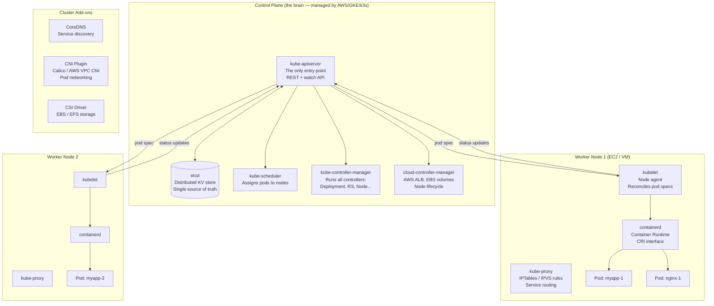
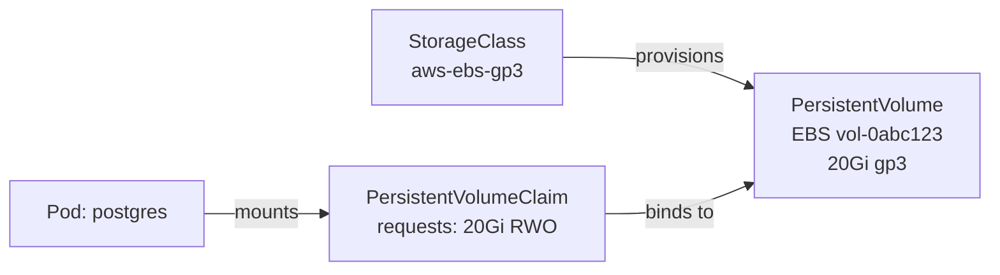
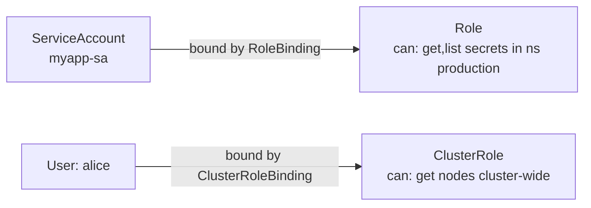

# Kubernetes: From Zero to Production

> **The Anvaya:** *Kubernetes is a reconciliation machine — you declare the desired state in YAML, and a set of controllers work endlessly to make reality match that declaration.*

## 🪝 The Hook

You have a Docker container. You want it to always be running (self-healing), scale under load, receive traffic, have its config separate from its image, and update without downtime. Kubernetes is the system that handles all of this — declaratively.

---

## **Cluster Architecture**



💡 **The key insight:** All components only talk to `kube-apiserver`. No component talks directly to another. `etcd` is the ground truth — everything else is a view of (or reaction to) what's in etcd.

---

## **Phase 1: The Absolute Minimum — Run a Pod**

**Goal:** Understand the smallest deployable unit.

```yaml
# pod.yml — you almost never write this directly in production
apiVersion: v1
kind: Pod
metadata:
  name: myapp
  namespace: default
  labels:
    app: myapp        # Labels are the glue — Services and selectors use these
spec:
  containers:
    - name: myapp
      image: nginx:1.27
      ports:
        - containerPort: 80
      resources:
        requests:              # Scheduler uses these to find a fitting node
          cpu: "100m"          # 100 millicores = 0.1 of a CPU core
          memory: "128Mi"
        limits:                # Runtime enforces these: OOMKill if exceeded
          cpu: "200m"
          memory: "256Mi"
```

```bash
kubectl apply -f pod.yml
kubectl get pods
kubectl describe pod myapp     # Full detail: events, node, IP, conditions
kubectl logs myapp             # stdout/stderr of the container
kubectl exec -it myapp -- /bin/sh   # Shell inside the container
kubectl delete pod myapp       # Pod is gone and NOT restarted — Pods alone are mortal
```

💡 **Preview changes before applying:**

```bash
kubectl diff -f deployment.yml   # Shows a diff of what would change vs current cluster state
```

Use this in CI to catch unintended changes. Returns exit code `1` if there are differences — useful as a gate.

⚠️ **ANTI-PATTERN: Running bare Pods in production**
If you write a Pod spec directly, when that pod crashes or the node goes down, it's gone permanently. Always use a **Deployment** (or StatefulSet, DaemonSet) which uses a **controller** to keep pods alive.

---

## **Phase 2: Namespace — Multi-tenancy & Scoping**

**Goal:** Isolate teams, environments, or services within the same cluster.

```bash
kubectl create namespace production
kubectl create namespace staging

# All objects are namespace-scoped (except Nodes, PersistentVolumes, StorageClasses)
kubectl -n production get pods
kubectl -n production get services
kubectl -n production get all    # Everything in the namespace
```

```yaml
# Always set namespace in metadata — avoid relying on kubectl config defaults
metadata:
  name: myapp
  namespace: production
```

💡 **TIP: ResourceQuota per namespace**

```yaml
apiVersion: v1
kind: ResourceQuota
metadata:
  name: production-quota
  namespace: production
spec:
  hard:
    pods: "50"
    requests.cpu: "10"
    requests.memory: "20Gi"
    limits.cpu: "20"
    limits.memory: "40Gi"
```

Prevents one team from consuming the entire cluster's resources.

---

## **Phase 3: Deployment — Self-Healing, Rolling Updates**

**Goal:** Declare "I want 3 replicas of this container always running."

```yaml
# deployment.yml
apiVersion: apps/v1
kind: Deployment
metadata:
  name: myapp
  namespace: production
spec:
  replicas: 3
  selector:
    matchLabels:
      app: myapp       # Must match .spec.template.metadata.labels
  strategy:
    type: RollingUpdate
    rollingUpdate:
      maxUnavailable: 1   # At most 1 pod down during update
      maxSurge: 1         # At most 1 extra pod during update
  template:              # This is a Pod template
    metadata:
      labels:
        app: myapp       # Must match .spec.selector.matchLabels
    spec:
      containers:
        - name: myapp
          image: myapp:v1
          ports:
            - containerPort: 8080
          resources:
            requests:
              cpu: "250m"
              memory: "256Mi"
            limits:
              cpu: "500m"
              memory: "512Mi"
          readinessProbe:    # Gate: pod only receives traffic when this passes
            httpGet:
              path: /healthz
              port: 8080
            initialDelaySeconds: 5
            periodSeconds: 10
          livenessProbe:     # Restart trigger: kubelet OOMKills & restarts if this fails
            httpGet:
              path: /healthz
              port: 8080
            initialDelaySeconds: 15
            failureThreshold: 3
```

**Rolling update — what actually happens:**

```mermaid
gantt
    title Rolling Update: v1 → v2 (replicas=3, maxUnavailable=1, maxSurge=1)
    dateFormat s
    axisFormat %Ss

    section Old Pods (v1)
    pod-v1-a Running  :done, 0, 30s
    pod-v1-b Running  :done, 0, 20s
    pod-v1-c Running  :done, 0, 10s

    section New Pods (v2)
    pod-v2-a Starting→Ready    :active, 5s, 10s
    pod-v2-b Starting→Ready    :active, 15s, 10s
    pod-v2-c Starting→Ready    :active, 25s, 10s
```

```bash
kubectl -n production set image deployment/myapp myapp=myapp:v2
kubectl -n production rollout status deployment/myapp   # Watch progress
kubectl -n production rollout history deployment/myapp  # See revisions
kubectl -n production rollout undo deployment/myapp     # Instant rollback to v1
```

💡 **Tag images by git SHA, never `latest`.**
`latest` is mutable. If a new bad image is pushed, you can't distinguish the running version from the new one. Use `myapp:${GITHUB_SHA}` — rollout history then maps directly to git commits, and `rollout undo` reliably returns to the previous SHA.

⚠️ **`maxUnavailable: 0` + `maxSurge: 1` = zero-downtime, but slower.** Useful when you can't afford to shed traffic during a deploy (e.g., long-lived WebSocket connections). Trade-off: more memory/CPU headroom needed during the rollout.

---

## **Phase 4: Service — Stable Network Endpoint**

**Goal:** A stable DNS name and IP that routes to whatever pods match a label selector — even as pods are created and destroyed.

```yaml
# service.yml
apiVersion: v1
kind: Service
metadata:
  name: myapp
  namespace: production
spec:
  selector:
    app: myapp          # Routes to all pods with this label
  ports:
    - port: 80          # Port the Service listens on
      targetPort: 8080  # Port the container listens on
  type: ClusterIP       # Internal-only (default). Valid types below:
```

**Service types:**

| Type | Accessibility | Use Case |
| :--- | :--- | :--- |
| `ClusterIP` | Internal cluster only | App → DB, microservice → microservice |
| `NodePort` | Cluster + node's external IP | Dev/testing, not production |
| `LoadBalancer` | External (cloud LB provisioned) | Expose one service; use Ingress for multiple |
| `ExternalName` | DNS alias to external hostname | Bridge cluster to external service |

**DNS:** Inside the cluster, any pod can reach `myapp.production.svc.cluster.local` (or just `myapp` from within the same namespace). CoreDNS resolves these names.

```bash
# From a pod inside the cluster:
curl http://myapp.production/api/users     # Works! CoreDNS resolves to Service ClusterIP
curl http://myapp/api/users               # Works too, within same namespace
```

💡 **Headless Services for StatefulSets:**
`clusterIP: None` makes a Service headless — DNS returns individual pod IPs instead of a single VIP. CoreDNS creates `postgres-0.postgres-headless.production.svc.cluster.local` → pod IP. Clients (e.g., Postgres replicas) can connect to specific pods by name.

⚠️ **Service `selector` mismatch is the #1 cause of 503s.** If your labels in the Deployment template don't exactly match the Service selector, no pods are added to Endpoints. The Service exists but routes to nothing. Debug with:

```bash
kubectl -n production get endpoints myapp   # Should list pod IPs
# If empty → label mismatch between Service selector and pod labels
```

---

## **Phase 5: ConfigMap & Secret — Separate Config from Code**

```yaml
# configmap.yml
apiVersion: v1
kind: ConfigMap
metadata:
  name: myapp-config
  namespace: production
data:
  APP_ENV: "production"
  LOG_LEVEL: "info"
  DB_HOST: "postgres.production.svc.cluster.local"
  config.yaml: |             # Can store entire config files
    server:
      port: 8080
      timeout: 30s
```

```yaml
# secret.yml — values are base64-encoded (NOT encrypted by default)
apiVersion: v1
kind: Secret
metadata:
  name: myapp-secrets
  namespace: production
type: Opaque
stringData:             # stringData auto-encodes to base64
  DB_PASSWORD: "sup3rS3cret"
  API_KEY: "sk-abcdef123"
```

```yaml
# Inject into a container (in Deployment spec):
containers:
  - name: myapp
    envFrom:
      - configMapRef:
          name: myapp-config       # Inject all keys as env vars
      - secretRef:
          name: myapp-secrets      # Inject all keys as env vars
    volumeMounts:
      - name: config-vol
        mountPath: /etc/myapp        # Mount config.yaml as a file
volumes:
  - name: config-vol
    configMap:
      name: myapp-config
      items:
        - key: config.yaml
          path: config.yaml
```

💡 **ConfigMap volume mounts hot-reload; `envFrom` does not.** If you inject a ConfigMap as a volume mount (`mountPath`), the file is updated in the pod within ~60 seconds when the ConfigMap changes. If you inject via `envFrom`, the container must restart to pick up changes. Use volume mounts for config that should update without restarts (feature flags, log levels).

⚠️ **ANTI-PATTERN: Storing secrets in Secrets objects alone on EKS**
Kubernetes Secrets are base64-encoded, not encrypted at rest by default. On EKS, enable **envelope encryption** with KMS. Alternatively, use the **Secrets Store CSI Driver** to pull secrets directly from AWS Secrets Manager into pods as files.

```bash
# Enable KMS envelope encryption at cluster creation:
eksctl create cluster --name myapp --with-oidc \
  --encryption-config '[{"resources":["secrets"],"provider":{"keyArn":"arn:aws:kms:..."}}]'
```

---

## **Phase 6: Ingress — Route External Traffic to Multiple Services**

**Goal:** One ALB (or nginx) routing different paths/hostnames to different internal services.

```yaml
# ingress.yml
apiVersion: networking.k8s.io/v1
kind: Ingress
metadata:
  name: myapp-ingress
  namespace: production
  annotations:
    kubernetes.io/ingress.class: alb                    # or nginx
    alb.ingress.kubernetes.io/scheme: internet-facing
    alb.ingress.kubernetes.io/target-type: ip
    alb.ingress.kubernetes.io/certificate-arn: "arn:aws:acm:..."
spec:
  rules:
    - host: api.example.com
      http:
        paths:
          - path: /v1
            pathType: Prefix
            backend:
              service: { name: api-v1, port: { number: 80 } }
          - path: /v2
            pathType: Prefix
            backend:
              service: { name: api-v2, port: { number: 80 } }
    - host: grafana.example.com
      http:
        paths:
          - path: /
            pathType: Prefix
            backend:
              service: { name: grafana, port: { number: 3000 } }
```

---

## **Phase 7: Persistent Storage — PVC & PV**

**Goal:** Give stateful containers (databases, caches) persistence that survives pod restarts.



⚠️ **EBS volumes are AZ-locked.** An EBS PV created in `ap-south-1a` can only be mounted by a pod scheduled to a node in `ap-south-1a`. If the pod moves AZs (e.g., after a node failure), the new pod stays `Pending`. Fix: `volumeBindingMode: WaitForFirstConsumer` ensures the EBS volume is created in the same AZ as the pod.

```yaml
# storageclass.yml — usually pre-installed on EKS
apiVersion: storage.k8s.io/v1
kind: StorageClass
metadata:
  name: ebs-gp3
provisioner: ebs.csi.aws.com
parameters:
  type: gp3
  encrypted: "true"
reclaimPolicy: Retain      # KEEP the EBS volume when PVC is deleted (safe for prod)
volumeBindingMode: WaitForFirstConsumer   # Don't provision until a pod is scheduled
```

```yaml
# pvc.yml — the "I need storage" request
apiVersion: v1
kind: PersistentVolumeClaim
metadata:
  name: postgres-data
  namespace: production
spec:
  accessModes: [ReadWriteOnce]   # RWO: one node at a time (EBS). RWX: many nodes (EFS)
  storageClassName: ebs-gp3
  resources:
    requests:
      storage: 20Gi
```

```yaml
# In Pod or StatefulSet spec:
volumes:
  - name: data
    persistentVolumeClaim:
      claimName: postgres-data
containers:
  - name: postgres
    volumeMounts:
      - name: data
        mountPath: /var/lib/postgresql/data
```

---

## **Phase 8: StatefulSet — Ordered, Stable, Stateful Pods**

**Goal:** Deploy databases, Kafka, Elasticsearch — anything that needs stable network identity and stable storage.

```yaml
# statefulset.yml
apiVersion: apps/v1
kind: StatefulSet
metadata:
  name: postgres
  namespace: production
spec:
  serviceName: postgres-headless   # Each pod gets: postgres-0.postgres-headless.production.svc.cluster.local
  replicas: 1
  selector:
    matchLabels:
      app: postgres
  template:
    metadata:
      labels:
        app: postgres
    spec:
      containers:
        - name: postgres
          image: postgres:16
          env:
            - name: POSTGRES_PASSWORD
              valueFrom:
                secretKeyRef:
                  name: myapp-secrets
                  key: DB_PASSWORD
          volumeMounts:
            - name: data
              mountPath: /var/lib/postgresql/data
  volumeClaimTemplates:   # Each pod gets its own PVC (persistent-0, persistent-1, ...)
    - metadata:
        name: data
      spec:
        accessModes: [ReadWriteOnce]
        storageClassName: ebs-gp3
        resources:
          requests:
            storage: 20Gi
```

💡 **Trigger a Postgres failover by deleting the pod:**

```bash
kubectl -n production delete pod postgres-0
# StatefulSet recreates postgres-0 on the same PVC — data is preserved
# Patroni / streaming replication handles the switchover
```

This is how you force a controlled replica promotion during maintenance.

**Differences from Deployment:**

| | Deployment | StatefulSet |
| :--- | :--- | :--- |
| Pod names | Random hash: `myapp-5d4b8c-xyz` | Ordinal: `postgres-0`, `postgres-1` |
| DNS name | Shared Service ClusterIP | Per-pod: `postgres-0.svc-name` |
| Storage | Shared or ephemeral | Per-pod PVC (persists on pod restart) |
| Scaling | Parallel | Ordered (0 before 1 before 2) |
| Deletion | Any order | Reverse order (N-1 before N-2 before 0) |

---

## **Phase 9: DaemonSet — One Pod Per Node**

**Goal:** Deploy a system agent on every node (log collector, monitoring agent, CNI plugin, Device Plugin).

```yaml
apiVersion: apps/v1
kind: DaemonSet
metadata:
  name: node-exporter
  namespace: monitoring
spec:
  selector:
    matchLabels:
      app: node-exporter
  template:
    metadata:
      labels:
        app: node-exporter
    spec:
      hostNetwork: true            # Sees node's network interfaces
      hostPID: true                # Sees node's processes
      tolerations:
        - operator: Exists         # Run even on tainted nodes (control plane, GPU nodes)
      containers:
        - name: node-exporter
          image: prom/node-exporter:latest
          ports:
            - containerPort: 9100
              hostPort: 9100
          securityContext:
            privileged: true       # Needs access to host metrics
```

---

## **Phase 10: RBAC — Who Can Do What**

**Goal:** Prevent a compromised pod from reading all cluster secrets or deleting deployments.



```yaml
# role.yml — namespace-scoped permissions
apiVersion: rbac.authorization.k8s.io/v1
kind: Role
metadata:
  name: myapp-role
  namespace: production
rules:
  - apiGroups: [""]            # "" = core API group
    resources: ["pods", "pods/log"]
    verbs: ["get", "list", "watch"]
  - apiGroups: ["apps"]
    resources: ["deployments"]
    verbs: ["get", "list", "patch"]  # Can update but not delete
```

```yaml
# rolebinding.yml — attach role to a ServiceAccount
apiVersion: rbac.authorization.k8s.io/v1
kind: RoleBinding
metadata:
  name: myapp-rolebinding
  namespace: production
subjects:
  - kind: ServiceAccount
    name: myapp-sa
    namespace: production
roleRef:
  kind: Role
  name: myapp-role
  apiGroup: rbac.authorization.k8s.io
```

⚠️ **Never use `verbs: ["*"]` or `resources: ["*"]` in production Roles.** A compromised pod with wildcard RBAC can read all Secrets in the namespace, scale deployments to 0, or exfiltrate data. Grant only the exact verbs and resources the workload needs. Audit existing RBAC with:

```bash
kubectl get rolebindings,clusterrolebindings -A -o json | \
  jq '.items[] | select(.roleRef.name | test("admin|cluster-admin|edit")) | .metadata.name'
```

```bash
# Test what a ServiceAccount can do:
kubectl auth can-i get pods --namespace production --as=system:serviceaccount:production:myapp-sa
# yes
kubectl auth can-i delete deployments --namespace production --as=system:serviceaccount:production:myapp-sa
# no
```

---

## **Phase 11: Horizontal Pod Autoscaler**

```yaml
apiVersion: autoscaling/v2
kind: HorizontalPodAutoscaler
metadata:
  name: myapp
  namespace: production
spec:
  scaleTargetRef:
    apiVersion: apps/v1
    kind: Deployment
    name: myapp
  minReplicas: 3
  maxReplicas: 20
  metrics:
    - type: Resource
      resource:
        name: cpu
        target:
          type: Utilization
          averageUtilization: 60    # Scale out when avg CPU across pods > 60%
    - type: Resource
      resource:
        name: memory
        target:
          type: AverageValue
          averageValue: "400Mi"     # Scale out when avg memory > 400Mi per pod
```

---

## 🔒 Security & Pitfalls

💡 **HPA and VPA don't play well on the same metric.** HPA scaling on CPU + VPA adjusting CPU requests = feedback loop. If you use both: configure HPA on custom/external metrics (e.g., queue depth, RPS) and let VPA handle CPU/memory sizing independently.

---

## 🔒 Security & Pitfalls

### 1. Missing Resource Limits = Noisy Neighbor

Without `resources.limits`, one misbehaving pod can consume all node CPU/memory and evict all other pods. Set **both** `requests` (for scheduling) and `limits` (for enforcement) on every container.

### 2. No Liveness/Readiness Probes = Silent Failures

A container that starts but is stuck in an infinite loop shows `Running` status. Without a `livenessProbe`, Kubernetes never restarts it. Without a `readinessProbe`, the Service sends traffic to a pod that returns errors.

### 3. `default` Namespace in Production

Using the `default` namespace means all your resources mix with any test work. Always use named namespaces with RBAC and ResourceQuota.

### 4. `imagePullPolicy: Always` in Production

Causes ECR auth on every pod start — if ECR is slow or rate-limited, pods fail to start. Use `IfNotPresent` with immutable image tags (by digest or git SHA), not `latest`.

### 5. Pod Disruption Budget — Missing = Outage During Node Drain

When a node is drained (`kubectl drain`) for maintenance, all pods evicted immediately — even if that takes your Deployment below `minReplicas`. A `PodDisruptionBudget` enforces a minimum during voluntary disruptions:

```yaml
apiVersion: policy/v1
kind: PodDisruptionBudget
metadata:
  name: myapp-pdb
  namespace: production
spec:
  minAvailable: 2      # At least 2 pods must remain running during drain
  selector:
    matchLabels:
      app: myapp
```

Kubernetes will refuse to evict a pod if doing so would violate the PDB. Node upgrades (EKS managed node groups) honor PDBs automatically.

### 6. Forgetting `preStop` Hook for Graceful Shutdown

When a pod is terminated, K8s sends `SIGTERM` AND simultaneously removes the pod from Endpoints. The ~2s race means the load balancer may still route traffic to the terminating pod. Add a `preStop` sleep:

```yaml
lifecycle:
  preStop:
    exec:
      command: ["sleep", "5"]   # Give the LB time to stop routing before SIGTERM
terminationGracePeriodSeconds: 30
```

---

## 🚀 Summary Checklist

* ✅ **Phase 1:** Never run bare Pods. Use controllers.
* ✅ **Phase 2:** Namespace per environment/team + ResourceQuota.
* ✅ **Phase 3:** Deployment with RollingUpdate strategy.
* ✅ **Phase 4:** Service for stable internal DNS. ClusterIP for internal; Ingress for external.
* ✅ **Phase 5:** ConfigMap for config; Secret (KMS-encrypted) for sensitive values.
* ✅ **Phase 6:** Ingress for multi-service HTTP routing.
* ✅ **Phase 7:** PVC + StorageClass for persistent storage.
* ✅ **Phase 8:** StatefulSet for databases — stable names, per-pod storage.
* ✅ **Phase 9:** DaemonSet for node-level agents.
* ✅ **Phase 10:** RBAC — ServiceAccounts with minimal Roles, no wildcard verbs.
* ✅ **Phase 11:** HPA for dynamic scaling based on CPU/memory.
