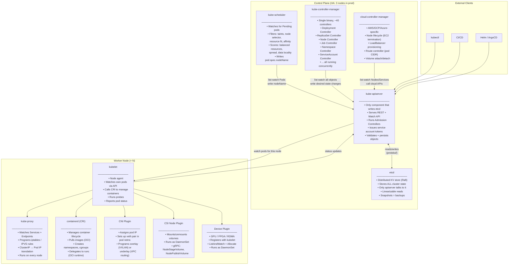
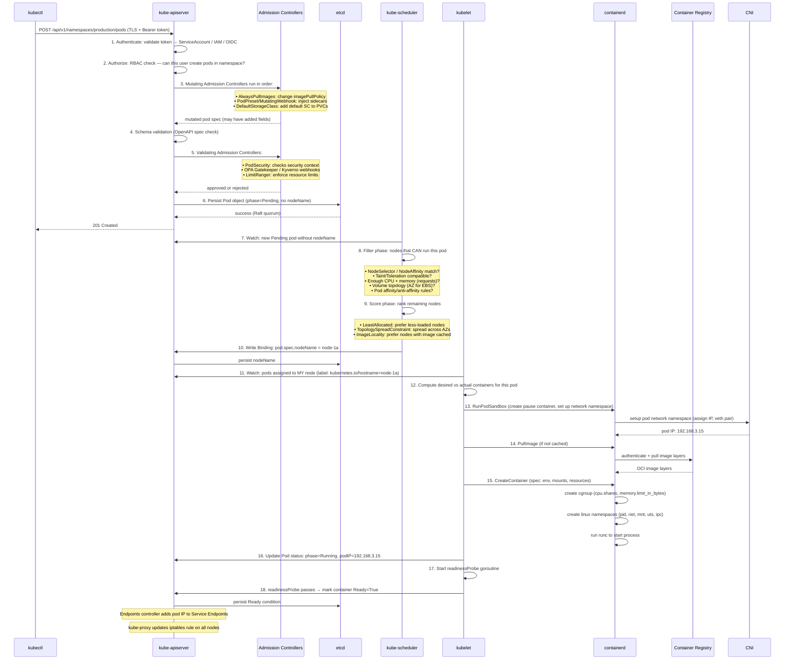
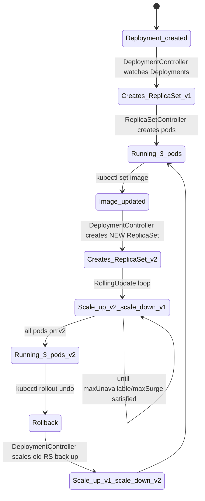
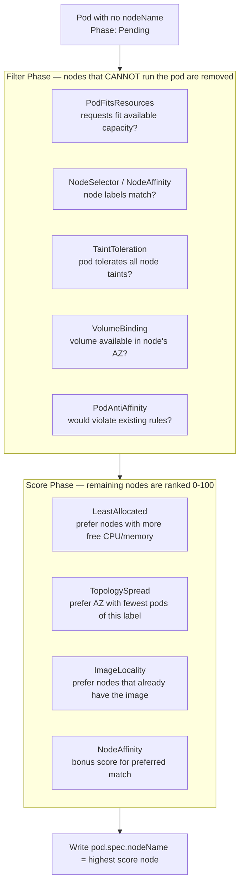
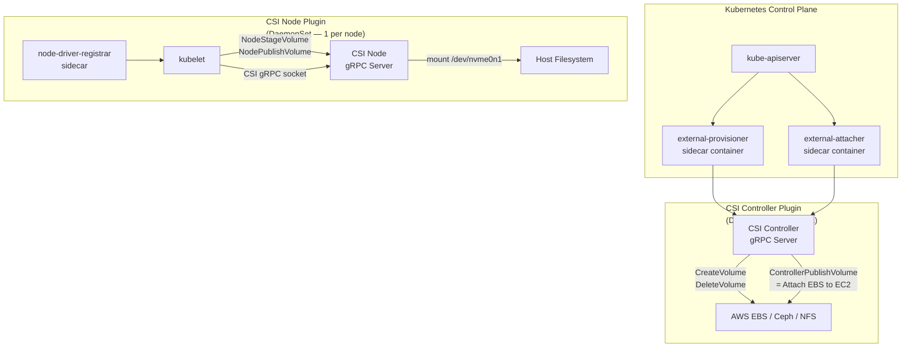
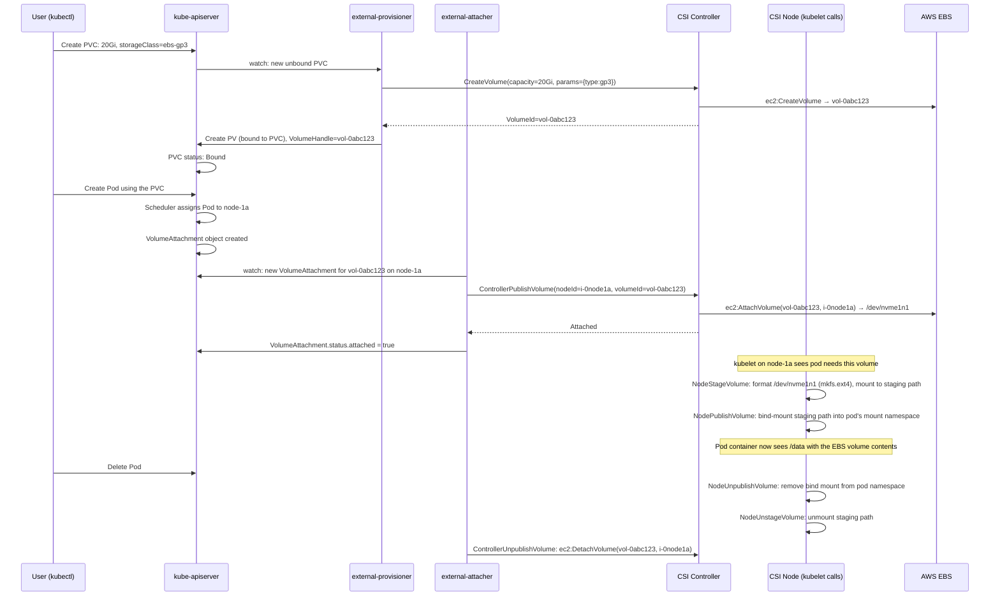
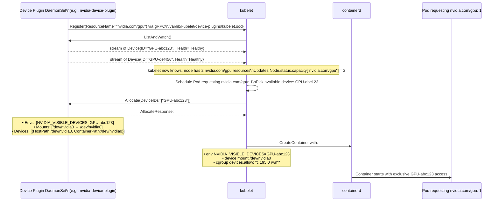
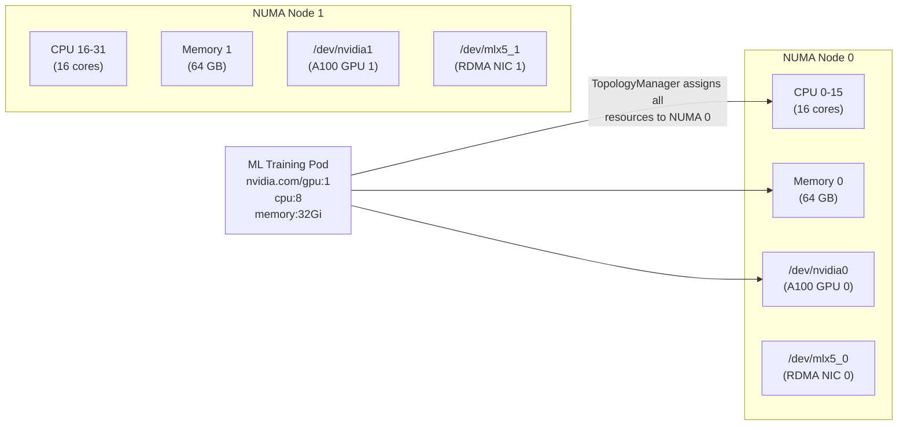
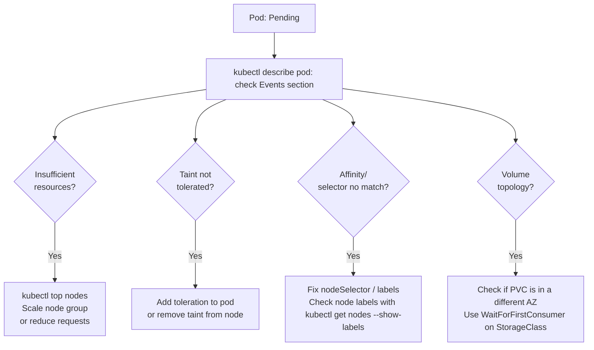

# Kubernetes: Internals & Advanced Architecture

> **The Anvaya:** *Kubernetes is not magic — it is a control loop: watch the world, compare to desired state, act to close the gap. Every component from etcd to the kubelet runs this same loop.*

## 🪝 The Hook

`kubectl apply -f pod.yml` takes 300ms. In those 300ms, your YAML travels through 7 components, gets validated, persisted, scheduled, and handed off to a container runtime. Understanding this journey makes you infinitely better at debugging why something isn't running.

---

## **I. Full Control Plane Architecture**



---

## **II. What Happens When You Run `kubectl apply -f pod.yml`**



💡 **Why does `kubectl apply` return instantly but the pod takes 20 seconds?**
`kubectl apply` only waits for step 6 (etcd persist). Steps 7–18 run asynchronously. That's why `kubectl get pods` shows `ContainerCreating` — the scheduler and kubelet haven't finished yet.

💡 **`kubectl apply --server-side` (SSA) is superior to client-side apply.** Classic `kubectl apply` stores the last-applied config in an annotation on the object (max 262 KB). Server-side apply (available since 1.18, default in 1.22+) moves merge logic to the server and tracks field ownership — multiple managers (kubectl, Helm, an operator) can own different fields without clobbering each other.

```bash
kubectl apply --server-side -f deployment.yml
# Field ownership tracked in metadata.managedFields
```

⚠️ **Admission webhook timeouts can cause mysterious 504s during `kubectl apply`.** If a MutatingWebhook or ValidatingWebhook pod is down and its `failurePolicy` is `Fail` (default), ALL object creates/updates in the matched namespace fail. Always set `failurePolicy: Ignore` on non-critical admission webhooks and check:

```bash
kubectl get validatingwebhookconfigurations,mutatingwebhookconfigurations
# Identify the webhook, then check its pod is running
```

---

## **III. Controllers & the Controller Manager**

Every Kubernetes "resource type" has a **controller** watching it. They all follow the same pattern:

```
Control Loop:
  1. Watch the API for objects of my type
  2. Compare actual state to desired state
  3. Act to close the gap
  4. Update status
  5. Goto 1
```

The `kube-controller-manager` is a single binary that runs ~40 of these controllers concurrently.

### **Deployment Controller**



**What the Deployment controller does NOT do:** Create pods directly. It creates/scales **ReplicaSets**. The ReplicaSet controller creates/deletes pods. This separation is why `kubectl rollout undo` is instant — it just flips the ReplicaSet scales; the pods are already there.

### **ReplicaSet Controller**

Owns a set of pods identified by a **label selector**. Its only job: keep pod count == `replicas`.

```
Every ~5 seconds (or on any Pod event):
  running = count(pods matching selector AND owned by this RS AND not terminating)
  if running < desired:
    create (desired - running) pods
  if running > desired:
    delete (running - desired) pods (pick: unscheduled > not ready > oldest > random)
```

Key gotcha: An RS uses **ownership** (`.metadata.ownerReferences`) to track its pods — not just labels. If you manually delete the `ownerReference`, the RS adopts any matching pod it finds.

### **Node Controller**

Watches `Node` objects and pod health. Key behaviors:

- Sets `Ready=False` when a node stops heartbeating the API server (via kubelet → node lease).
- After `pod-eviction-timeout` (default 5 min), evicts all pods from the `NotReady` node.
- On cloud providers, uses `cloud-controller-manager` to check if the EC2 instance actually terminated (avoids split-brain false evictions).

💡 **Since Kubernetes 1.18+, eviction is taint-based, not timeout-based.** The node controller adds `node.kubernetes.io/not-ready:NoExecute` and `node.kubernetes.io/unreachable:NoExecute` taints. Pods can set `tolerationSeconds` to survive a node blip:

```yaml
tolerations:
  - key: "node.kubernetes.io/not-ready"
    operator: "Exists"
    effect: "NoExecute"
    tolerationSeconds: 30   # Pod survives a 30s node blip before being evicted
```

Set this for stateful workloads or slow-startup jobs to avoid unnecessary rescheduling during brief EC2 metadata hiccups.

### **Job & CronJob Controllers**

```yaml
# Job: run a pod to completion (not forever)
apiVersion: batch/v1
kind: Job
metadata:
  name: db-migrate
spec:
  completions: 1         # Run 1 successful pod
  parallelism: 1         # Run 1 at a time
  backoffLimit: 3        # Retry up to 3 times on failure
  ttlSecondsAfterFinished: 3600   # Auto-cleanup 1h after completion
  template:
    spec:
      restartPolicy: Never    # Must be Never or OnFailure for Jobs
      containers:
        - name: migrate
          image: myapp:latest
          command: ["./migrate", "--up"]
```

```yaml
# CronJob: schedule Jobs
apiVersion: batch/v1
kind: CronJob
metadata:
  name: report-generator
spec:
  schedule: "0 2 * * *"         # Every day at 2am UTC (standard cron syntax)
  concurrencyPolicy: Forbid      # Don't start a new job if previous is still running
  successfulJobsHistoryLimit: 3
  failedJobsHistoryLimit: 1
  jobTemplate:
    spec:
      template:
        spec:
          restartPolicy: OnFailure
          containers:
            - name: report
              image: myapp:latest
              command: ["./generate-report"]
```

### **Garbage Collection Controller**

Kubernetes uses **owner references** to track object hierarchies:

```
Deployment → owns → ReplicaSet → owns → Pod
CronJob → owns → Job → owns → Pod
StatefulSet → owns → PVC (NOT owned — intentional for data safety)
```

When a parent is deleted:

- **Foreground deletion:** Parent enters terminating state, waits for all children to die first.
- **Background deletion** (default): Parent is deleted immediately, orphaned children are GC'd asynchronously.
- **Orphan:** Children survive. Dangerous — orphaned ReplicaSets keep creating pods.

```bash
# Delete deployment AND all its pods:
kubectl delete deployment myapp                     # cascade=background (default)

# Delete ONLY the deployment, keep pods running:
kubectl delete deployment myapp --cascade=orphan    # Be careful!
```

---

## **IV. The Scheduler in Depth**



**Taints & Tolerations — the inverse of affinity:**

```yaml
# On a node: "Repel all pods that don't explicitly tolerate this"
kubectl taint nodes node-gpu-1 gpu=true:NoSchedule
# Only GPU workloads should land here

# In the Pod spec: "I tolerate the gpu=true taint"
tolerations:
  - key: "gpu"
    operator: "Equal"
    value: "true"
    effect: "NoSchedule"
```

Useful patterns:

- `NoSchedule`: Don't schedule new pods on this node. Existing pods stay.
- `NoExecute`: Evict existing pods that don't tolerate this taint.
- `PreferNoSchedule`: Soft — try to avoid but not enforced.

Node controller applies `node.kubernetes.io/not-ready:NoExecute` automatically on unhealthy nodes.

💡 **Check what's actually schedulable on a node (vs what's installed):**

```bash
kubectl describe node node-1a | grep -A10 "Allocated resources"
# CPU Requests: 1750m (87%)     ← node near CPU saturation
# Memory Requests: 3Gi (80%)    ← almost no memory headroom
# This is why your pod is Pending even though the node looks "Ready"
```

The scheduler uses `requests`, not `limits`, and not actual usage. A node can show 10% actual CPU use but be 100% "allocated" by requests, making it unschedulable.

---

## **V. CSI — Container Storage Interface**

### **The Why**

Before CSI (pre 2018), every storage provider (AWS EBS, NFS, Ceph) had to write code directly **inside the Kubernetes source tree**. A bug in a storage driver required a Kubernetes release to fix. CSI moved storage drivers **out-of-tree** — any vendor can write a CSI driver as a container that runs in the cluster.

### **Linux Storage Background**

```
Physical layer:
  /dev/nvme0n1     ← block device (raw disk or EBS volume)
  /dev/nvme0n1p1   ← partition

Filesystem layer:
  mkfs.ext4 /dev/nvme0n1   ← creates a filesystem on the block device
  mount /dev/nvme0n1 /mnt/data  ← mounts at a path ("mount point")

Mount Namespaces (Linux kernel feature):
  Each process lives in a mount namespace — its own view of the filesystem tree.
  Containers get their own mount namespace → they see only their own mounts.
  When kubelet asks to "mount a volume into a pod", it's:
  1. Creating a bind mount from the host path into the container's mount namespace.
```

### **CSI Architecture**



### **Volume Lifecycle — Step by Step**



### **StorageClass — the provisioner config**

```yaml
apiVersion: storage.k8s.io/v1
kind: StorageClass
metadata:
  name: ebs-gp3
provisioner: ebs.csi.aws.com     # The CSI driver's name
parameters:
  type: gp3
  iops: "3000"
  throughput: "125"
  encrypted: "true"
  kmsKeyId: "arn:aws:kms:..."    # KMS key for EBS encryption
reclaimPolicy: Retain            # Delete or Retain the EBS vol when PVC is deleted
volumeBindingMode: WaitForFirstConsumer  # Don't create EBS vol until pod is scheduled (important: EBS is AZ-specific)
allowVolumeExpansion: true       # Allow PVC resize
```

⚠️ **ANTI-PATTERN: `reclaimPolicy: Delete` on production PVCs**
`Delete` means: when you `kubectl delete pvc`, the underlying EBS volume is **permanently deleted**. Someone accidentally deletes the PVC (easy to do), and your database is gone. Use `Retain` and manually manage deletion.

💡 **EBS volumes are AZ-locked at `ControllerPublishVolume` time.** Once a volume is attached to a node in `ap-south-1a`, if that node dies and the pod reschedules to a node in `ap-south-1b`, the pod stays Pending indefinitely — the volume can't follow. Fix with `WaitForFirstConsumer` (delays EBS creation until pod is placed) + topology spread to avoid single-AZ concentration.

---

## **VI. Device Plugins — Exposing Hardware to Pods**

### **Linux Background: How Hardware Resources Work**

```
Device files:
  /dev/nvidia0, /dev/nvidia1     ← GPU device files (character devices)
  /dev/dri/renderD128           ← DRM render node (GPU renders)
  Created by device drivers when hardware is detected.

cgroups (Control Groups):
  Linux kernel mechanism to limit/account resource usage by process groups.
  CPU: cpu.shares, cpu.cfs_quota_us
  Memory: memory.limit_in_bytes, memory.oom_control
  Devices: devices.allow, devices.deny ← controls which /dev files a process can open

  Example: prevent a container from accessing GPUs:
  echo "c 195:* rwm" > /sys/fs/cgroup/devices/container-xxx/devices.deny

NUMA (Non-Uniform Memory Access):
  On multi-socket machines, memory is physically closer to one CPU socket.
  Memory access from the "wrong" NUMA node is 2-3× slower.
  GPU-intensive workloads need GPU, CPU, and memory on the SAME NUMA node for peak performance.
  Device plugins communicate NUMA topology to kubelet via the TopologyManager API.
```

### **The Device Plugin Framework**

Before device plugins, adding GPU support required patching Kubernetes core. The Device Plugin API (stable since 1.10) lets vendors write an external plugin as a DaemonSet.



### **What the NVIDIA Device Plugin Actually Does**

```bash
# Install NVIDIA device plugin (DaemonSet)
kubectl apply -f https://raw.githubusercontent.com/NVIDIA/k8s-device-plugin/main/deployments/static/nvidia-device-plugin.yml

# After installation, nodes with GPUs show:
kubectl describe node gpu-node-1 | grep nvidia
# Capacity:
#   nvidia.com/gpu:  2        ← 2 physical GPUs
# Allocatable:
#   nvidia.com/gpu:  2
```

```yaml
# Request a GPU in a pod:
resources:
  limits:
    nvidia.com/gpu: 1       # Exclusive allocation — you get one full GPU
    cpu: "4"
    memory: "8Gi"
  requests:
    nvidia.com/gpu: 1       # Must equal limits for extended resources
```

💡 **GPU fractions with MIG (Multi-Instance GPU):** NVIDIA A100 GPUs support MIG — splitting one physical GPU into isolated instances (e.g., 7× `1g.10gb` slices). The NVIDIA MIG manager exposes `nvidia.com/mig-1g.10gb` as a separate resource. Pods can request a GPU slice instead of a whole GPU — better utilization.

⚠️ **Device plugin restarts lose in-flight Allocate calls.** If the device plugin DaemonSet pod restarts (image update, OOM), any pod in the middle of an `Allocate()` call fails to start. Kubelet retries, but there's a window of Pending pods. Use `priorityClassName: system-node-critical` on device plugin DaemonSets to prevent eviction:

```yaml
spec:
  priorityClassName: system-node-critical  # Same priority as CNI/CSI — never evicted
```

### **TopologyManager — NUMA-Aware Scheduling**

```bash
# Configure on kubelet (in kubelet config):
topologyManagerPolicy: best-effort  # or: none, restricted, single-numa-node

# When a pod requests GPU + large CPU + memory, kubelet tries to place all resources
# on the same NUMA node to minimize memory latency.
```



Without TopologyManager, a pod might get CPU from NUMA 0 and GPU on NUMA 1 — reads from GPU-attached memory hop across the PCIe-NUMA bridge, 3× slower.

---

## **VII. Practical Scenarios**

### **Scenario A: Pod stuck in `Pending` state**

```bash
kubectl -n production describe pod myapp-xxx
# Events:
#   0/3 nodes are available:
#   1 Insufficient memory,
#   2 node(s) had untolerated taint {node.kubernetes.io/not-ready: }
```

**Diagnosis flow:**



### **Scenario B: Pod stuck in `CrashLoopBackOff`**

```bash
# Get last exit reason
kubectl -n production describe pod myapp-xxx | grep -A5 "Last State"
# Exit Code: 137 → OOMKilled (memory limit hit)
# Exit Code: 1   → Application non-zero exit
# Exit Code: 139 → Segfault

# Get logs from PREVIOUS crashed container:
kubectl -n production logs myapp-xxx --previous

# Watch live restart cycle:
kubectl -n production get pod myapp-xxx -w
```

**Common causes:**

| Symptom | Root Cause | Fix |
| :--- | :--- | :--- |
| Exit code 137 | OOMKill — memory limit too low | Increase `resources.limits.memory` |
| Exit code 1, logs show "connection refused" | App depends on DB not yet ready | Add `initContainer` that waits for DB |
| Exit code 1, logs empty | App crashes before writing logs | Lower `initialDelaySeconds` on readinessProbe |
| `Back-off restarting failed container` | CrashLoopBackOff exponential delay | Fix the crash — delay resets with `kubectl rollout restart` |

### **Scenario C: Service not routing to pods**

```bash
kubectl -n production get endpoints myapp
# NAME    ENDPOINTS            AGE
# myapp   <none>               5m   ← No endpoints!

# Diagnosis: endpoints controller only adds pods where:
# 1. Pod label matches Service selector
# 2. Pod is Ready (readinessProbe passed)
# 3. Pod is not terminating

# Check pod labels:
kubectl -n production get pods --show-labels | grep myapp
# myapp-xxx   Running   app=myapp-v2   ← label is 'myapp-v2', Service expects 'myapp'

# Check pod readiness:
kubectl -n production get pods
# myapp-xxx   0/1 Running   ← 0 of 1 containers Ready → readinessProbe failing
kubectl -n production describe pod myapp-xxx | grep -A10 "Readiness"
```

---

## **VIII. etcd — The Heart of the Cluster**

```
etcd key structure (everything Kubernetes stores here):
  /registry/pods/production/myapp-xxx          ← Pod object (protobuf)
  /registry/deployments/production/myapp       ← Deployment object
  /registry/services/specs/production/myapp    ← Service object
  /registry/secrets/production/myapp-secrets   ← Secret (optionally KMS-encrypted)
  /registry/minions/node-1a                    ← Node object

Watch API:
  etcd supports long-polling watches. When a value changes, all watchers are notified instantly.
  This is how the scheduler, controllers, and kubelet get real-time updates — not polling.
```

**etcd backup — non-negotiable in self-managed clusters:**

```bash
# Snapshot etcd to S3 (run from the etcd node or via etcdctl)
ETCDCTL_API=3 etcdctl snapshot save /tmp/etcd-snapshot.db \
  --endpoints=https://127.0.0.1:2379 \
  --cacert=/etc/kubernetes/pki/etcd/ca.crt \
  --cert=/etc/kubernetes/pki/etcd/server.crt \
  --key=/etc/kubernetes/pki/etcd/server.key

aws s3 cp /tmp/etcd-snapshot.db s3://mycluster-backups/etcd/$(date +%Y%m%d-%H%M).db

# Restore from snapshot:
ETCDCTL_API=3 etcdctl snapshot restore /tmp/etcd-snapshot.db \
  --data-dir /var/lib/etcd-restored
```

On **managed clusters (EKS, GKE, AKS):** etcd is fully managed by the cloud provider. You never touch it. Backup is the provider's responsibility.

💡 **etcd performance degrades with too many resources. 8,000+ secrets/configmaps in a namespace causes slow watch responses.** Prune old completed Jobs (use `ttlSecondsAfterFinished`), delete orphaned ReplicaSets, and use `kubectl get events` instead of `kubectl get events --watch` — long-running watches hold etcd goroutines open.

⚠️ **etcd quorum math: 3 nodes tolerate 1 failure; 5 nodes tolerate 2.** An even number (4) gives no advantage over the next lower odd number (3) — same fault tolerance, more overhead. Always run etcd with 3 or 5 members in production.
