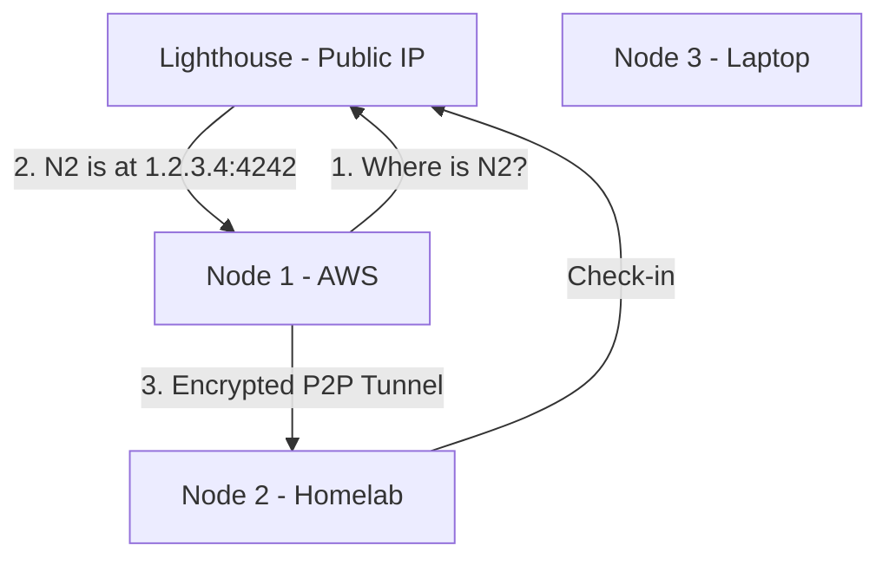

# Learning Nebula: From Zero to Production

> **The Anvaya:** *Security is baked into the identity, not the perimeter.*

---

## 🪝 The Hook

You have servers in 3 different clouds and a homelab. Setting up traditional Site-to-Site VPNs took 2 days, involved 500 lines of XML, and broke every time an IP changed. Nebula does it in 10 minutes with one binary.

---

## **The Problem & The Solution**

* **The Problem:** Traditional VPNs (OpenVPN, IPsec) are "Hub and Spoke." All traffic flows through a single bottleneck. They are hard to configure and fail if the "Hub" dies.
* **The Solution:** Nebula is a **Mesh** network. It is "Peer-to-Peer" by default. It uses **Lighthouses** [[?](Concepts.md#lighthouse)] only for discovery, not for data. It is faster, more resilient, and uses modern encryption (**Noise Protocol** [[?](Concepts.md#noise-protocol)]).

---

## **Architecture Overview**



---

## **Phase 1: The Foundation - The CA**

**Goal:** Create your private network's identity.

### **Step 1: Create the CA**

Download the `nebula-cert` binary.

```bash
# This creates ca.key (SECRET) and ca.crt (PUBLIC)
./nebula-cert ca -name "Brahmanda Mesh"
```

✨ **BEST PRACTICE: Offline CA**
Never store `ca.key` on a server. Keep it on a hardware-encrypted USB or a password manager. If `ca.key` is stolen, the attacker can join your network.

---

## **Phase 2: The Directory - The Lighthouse**

**Goal:** Setup the "Phonebook" of your network.

### **Step 2: Sign the Lighthouse Cert**

```bash
./nebula-cert sign -name "lighthouse-01" -ip "10.0.0.1/24"
```

### **Step 3: Configure `config.yml`**

The Lighthouse needs `am_lighthouse: true`.

```yaml
# config.yml (Snippet)
lighthouse:
  am_lighthouse: true
  serve_dns: true # Optional: acts as a DNS server for overlay IPs
```

---

## **Phase 3: The Mesh - Adding Nodes**

**Goal:** Connect your first client node.

### **Step 4: Sign the Node Cert**

```bash
# Assign groups for security rules
./nebula-cert sign -name "web-prod-01" -ip "10.0.0.2/24" -groups "web,prod"
```

### **Step 5: Configure the Node**

The node needs to know where the Lighthouse is.

```yaml
# config.yml (Snippet)
static_host_map:
  "10.0.0.1": ["public.lighthouse.ip:4242"]

lighthouse:
  am_lighthouse: false
  hosts:
    - "10.0.0.1"
```

**What You Learned:**

* ✅ **Overlay IP** (`10.0.0.2`) is what nodes use to talk.
* ✅ **Static Host Map** tells nodes how to find the Lighthouse initially.
* ✅ **Lighthouse Hosts** is the list of nodes to ask for directions.

---

## **Phase 4: Security - Identity Firewalls**

**Goal:** Restrict traffic based on Groups [[?](Concepts.md#groups)].

### **Step 6: Define Rules**

Unlike `iptables`, Nebula rules use the cryptographically signed groups in the certificate.

```yaml
firewall:
  outbound:
    - port: any
      proto: any
      host: any

  inbound:
    - port: 22
      proto: tcp
      groups:
        - ssh-admins # Only nodes in this group can SSH in
```

**Hard-Learnt Nugget:**
Nebula's internal firewall is stateful. You only need to define the "Inbound" rule; Nebula automatically allows the return traffic for an established connection.

---

## **Phase 5: Running It - The Service**

**Goal:** Make Nebula survive reboots.

```bash
sudo tee /etc/systemd/system/nebula.service <<EOF
[Unit]
Description=Nebula Mesh Network
After=network.target

[Service]
ExecStart=/usr/local/bin/nebula -config /etc/nebula/config.yml
Restart=always
RestartSec=5

[Install]
WantedBy=multi-user.target
EOF
sudo systemctl enable --now nebula
```

**What You Learned:**

* ✅ **`-config -test`** — validate config before starting the service: `sudo nebula -config /etc/nebula/config.yml -test`
* ✅ The service needs to start `After=network.target` or it will try to bind before the NIC is ready.
* ✅ Verify the interface came up: `ip addr show nebula0`

💡 **TIP:** If Ansible manages this node, add a `wait_for` on `/sys/class/net/nebula0` before any tasks that depend on the Nebula IP. See [Hard-Learnt-Nuggets.md](Hard-Learnt-Nuggets.md) for the exact task.

⚠️ **ANTI-PATTERN: Distributing config via SCP manually.** Use Ansible + Jinja2 to template `config.yml` and push to all nodes. Manually copying files leads to config drift at node 10.

---

## 🔒 Security & Pitfalls

### 1. The `nebula0` Race Condition

* **Pitfall:** Ansible fails to find `ansible_nebula0` facts.
* **The Reason:** Ansible gathers facts *immediately* upon connection. If the Nebula service is starting up, the interface might not exist yet.
* **The Fix:** Use a `wait_for` task or a retry loop in Ansible to ensure the interface is up before running tasks that depend on the Nebula IP.

### 2. UDP vs TCP

* **Pitfall:** Nebula is 100% UDP.
* **The Risk:** Some restrictive corporate firewalls or coffee shop Wi-Fi block all non-standard UDP ports.
* **The Fix:** Run your Lighthouse on port `443` (UDP) to try and look like HTTPS traffic (QUIC), or use a relay.

### 3. MTU Issues

* **Pitfall:** SSH works, but `git clone` or large file transfers hang.
* **The Fix:** Nebula defaults to an MTU of 1300 to account for the overhead of the tunnel. If you still have issues, try lowering it to `1280`.

---

## 🚀 Summary Checklist

* ✅ **CA:** Created once, stored offline.
* ✅ **Lighthouse:** Needs a static public IP.
* ✅ **Encryption:** Automated via Noise protocol.
* ✅ **Firewall:** Based on signed Groups, not IPs.
* ✅ **NAT:** Traversed automatically via UDP hole punching.
